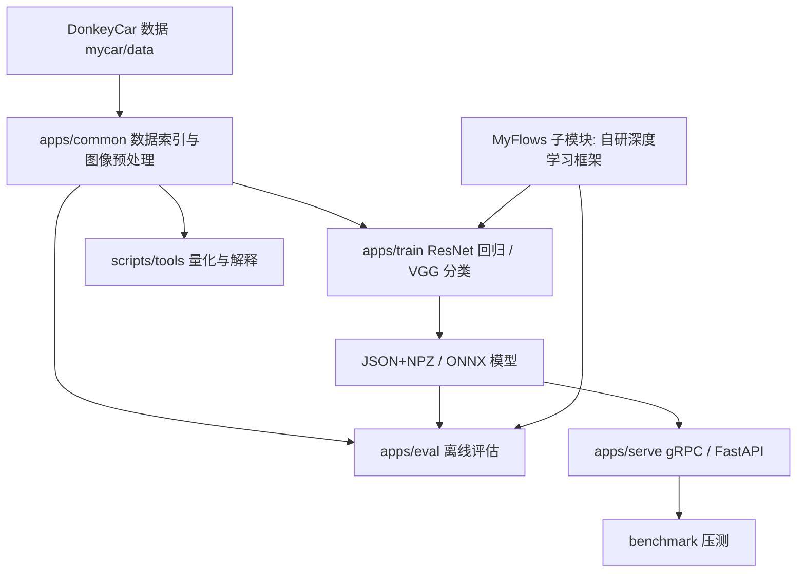

# DonkeyCar 自动驾驶课程项目

本项目用于 DonkeyCar 环境下的自动驾驶实验与课程验收。根仓库负责 DonkeyCar 应用层、训练/评估/部署入口、实验脚本、课程文档和展示流程；`MyFlows/` 保留为独立 Git 子模块/嵌套仓库结构，作为自研深度学习框架依赖，不在根仓库中摊平成普通源码目录。

项目围绕 `docs/本学期任务.md` 展开：在上学期 MyFlows 框架基础上，补齐训练可视化、数据增强、模型保存、ONNX/INT8 推理、gRPC 服务化部署、指标评价、卷积池化验证、DonkeyCar VGG 分类、跨框架 benchmark、Docker/Kubernetes 部署和报告文档。

## 任务书对应能力矩阵

| 任务书要求 | 本项目实现/入口 | 展示重点 |
| --- | --- | --- |
| 训练过程可视化 | `MyFlows/utils/training_dashboard.py`、`MyFlows/utils/observers/`、训练脚本 TensorBoard 参数 | loss、标签分布、梯度、参数、激活、增强图、checkpoint 事件 |
| 数据处理与增强 | `apps/common/`、`MyFlows/utils/transforms.py` | DonkeyCar 数据索引、NCHW 预处理、RandomCrop、Rotation、ColorJitter、MixUp、CutMix |
| 模型保存与导出 | `MyFlows/utils/checkpoint.py`、`MyFlows/utils/onnx_exporter.py` | JSON+NPZ checkpoint、ONNX 导出 |
| 推理与 INT8 量化 | `apps/eval/`、`tools/quantize_onnx.py`、`scripts/run_quantize_eval.py` | FP32/INT8 MSE、符号准确率、延迟、模型大小 |
| gRPC 服务化部署 | `proto/infer.proto`、`generated/grpc/`、`apps/serve/serve_grpc.py` | RPC 单图推理、结构化日志、压测结果 |
| 指标评价模块 | `MyFlows/utils/metrics_core/`、`apps/eval/` | 回归 MSE/符号准确率，分类 accuracy、混淆矩阵、macro F1 |
| 卷积和池化验证 | `MyFlows/tests/test_convolution.py` | im2col + GEMM、Conv2D/MaxPool 前反向与 naive 结果对比 |
| DonkeyCar VGG 分类 | `apps/train/train_vgg_donkey_classify.py`、`apps/eval/eval_vgg_donkey_classify.py` | 角度离散分类、分类指标 |
| 跨框架对比 | `benchmark/compare_frameworks.py`、`benchmark/plot_compare.py` | MyFlows / PyTorch / TensorFlow / PaddlePaddle 训练耗时、内存、FLOPs |
| 总体/模块/算法/详细设计 | `docs/system_design.md`、`docs/module_design.md`、`docs/algorithm_design.md`、`docs/detailed_design.md`、`docs/final_report.md` | 课程报告和答辩材料 |

## 项目架构



| 路径 | 职责 |
| --- | --- |
| `MyFlows/` | 自研深度学习框架子模块，包含计算图、算子、层、优化器、数据流水线、可视化、指标和测试 |
| `apps/common/` | DonkeyCar catalog/文件名解析、图像读取、resize、NCHW 转换、固定 batch padding |
| `apps/train/` | ResNet-18 转向/油门回归训练，VGG-11 转向角分类训练 |
| `apps/eval/` | MyFlows checkpoint、ONNX、VGG 分类的离线评估入口 |
| `apps/serve/` | ONNX predictor、gRPC/FastAPI 服务端、客户端 SDK、结构化日志和运行指标 |
| `tools/` | 数据转换、ONNX 量化、Grad-CAM 解释、设备运行时工具 |
| `scripts/` | FP32/INT8 量化评估报告等实验闭环脚本 |
| `benchmark/` | 跨框架训练对比、DataLoader 吞吐、在线服务压测 |
| `proto/`、`generated/grpc/` | gRPC 协议定义与生成代码 |
| `deploy/` | Docker Compose、Kubernetes、Kubeflow 示例 |
| `docs/` | 任务书、设计文档、验证指南、期末报告、实验结果说明 |
| `mycar/` | DonkeyCar 工程目录；数据、模型、日志属于本地运行资产 |
| `DonkeySimWin/` | DonkeyCar Windows 仿真器资产，按外部大文件处理 |

## 功能模块

### 数据与训练

DonkeyCar 图像和标签默认来自：

```text
mycar/data/images/*.jpg
mycar/data/catalog_generated.catalog
```

从 `generated-road-data` 重建 tub 数据：

```bash
python -m tools.convert_generated_road_to_tub_v2 --src mycar/generated-road-data --dst mycar/data --clear-dst
```

ResNet-18 回归训练：

```bash
python -m apps.train.train_myflows_donkey --max-samples 500 --epochs 2 --augment --graph-opt --export-onnx --device auto
```

VGG-11 转向角分类训练：

```bash
python -m apps.train.train_vgg_donkey_classify --max-samples 500 --epochs 2 --augment --mixup --cutmix --device auto
```

### 可视化与解释

训练脚本可写入 TensorBoard 标量、图像、histogram、参数/梯度/激活统计和增强图对比：

```bash
tensorboard --logdir mycar/logs/tensorboard
```

Grad-CAM 解释：

```bash
python -m tools.explain_donkey_gradcam --model-type resnet --checkpoint mycar/models/myflow_resnet18_best --data mycar/data --max-samples 8 --device auto
```

### 评估、量化与指标

ONNX 回归评估：

```bash
python -m apps.eval.eval_myflows_donkey_onnx --checkpoint mycar/models/myflow_resnet18_best.onnx --max-samples 2000 --device auto
```

VGG 分类评估：

```bash
python -m apps.eval.eval_vgg_donkey_classify --checkpoint mycar/models/vgg11_classify_best --max-samples 2000 --device auto
```

FP32/INT8 对比报告：

```bash
python scripts/run_quantize_eval.py --fp32 mycar/models/myflow_resnet18_best.onnx --max-samples 500 --device auto
```

### 服务化部署

启动 gRPC 服务并发送单图请求：

```bash
python -m apps.serve.serve_grpc --model mycar/models/myflow_resnet18_best.onnx --port 50051 --device auto
python -m apps.serve.grpc_client --image mycar/data/images/1042_0.0000.jpg --host 127.0.0.1 --port 50051
```

启动 FastAPI 服务并发送单图请求：

```bash
python -m apps.serve.serve_fastapi --model mycar/models/myflow_resnet18_best.onnx --port 8000 --device auto
python -m apps.serve.fastapi_client --image mycar/data/images/1042_0.0000.jpg --url http://127.0.0.1:8000 --show-model-info
```

服务压测：

```bash
python benchmark/serve_bench.py --mode local --model mycar/models/myflow_resnet18_best.onnx --out-json docs/experiments/serve_bench_local.json --out-md docs/experiments/serve_bench_local.md
```

### Benchmark 与部署

跨框架 benchmark：

```bash
python benchmark/compare_frameworks.py --epochs 2 --samples 64 --device auto
python benchmark/plot_compare.py
```

DataLoader 吞吐测试：

```bash
python benchmark/dataloader_bench.py --data mycar/data --batch 8 --batches 50
```

Docker Compose：

```bash
docker compose -f deploy/docker/docker-compose.yml up --build
```

## 展示流程

### 课堂快速演示

1. 展示目录结构和任务矩阵，说明 `MyFlows/` 是子模块/嵌套仓库，根仓库负责 DonkeyCar 应用和展示。
2. 检查 DonkeyCar 数据：

   ```bash
   python -m tools.analyze_donkey_data --data mycar/data
   ```

3. 验证卷积和池化：

   ```bash
   python MyFlows/tests/test_convolution.py
   ```

4. 快速训练 DonkeyCar ResNet：

   ```bash
   python -m apps.train.train_myflows_donkey --max-samples 200 --epochs 1 --device auto
   ```

5. 评估 ONNX 模型：

   ```bash
   python -m apps.eval.eval_myflows_donkey_onnx --checkpoint mycar/models/myflow_resnet18_best.onnx --max-samples 200 --device auto
   ```

6. 启动 gRPC 或 FastAPI，使用客户端 SDK 发送单图推理请求。
7. 展示 TensorBoard、训练曲线、Grad-CAM 或 `docs/experiments/` 中的实验材料。

### 正式验收补实验

```bash
python -m apps.train.train_myflows_donkey --max-samples 0 --epochs 20 --batch 2 --augment --graph-opt --checkpoint-every 500 --export-onnx --device auto
python -m apps.train.train_vgg_donkey_classify --max-samples 0 --epochs 10 --augment --device auto --export-onnx
python -m apps.eval.eval_vgg_donkey_classify --checkpoint mycar/models/vgg11_classify_best --max-samples 0 --device auto
python scripts/run_quantize_eval.py --fp32 mycar/models/myflow_resnet18_best.onnx --max-samples 500 --device auto
python benchmark/compare_frameworks.py --epochs 2 --samples 64 --device auto
python benchmark/plot_compare.py
python benchmark/dataloader_bench.py --data mycar/data --batch 8 --batches 50
python benchmark/serve_bench.py --mode local --model mycar/models/myflow_resnet18_best.onnx --out-json docs/experiments/serve_bench_local.json --out-md docs/experiments/serve_bench_local.md
```

更完整的逐项验证说明见 `docs/task_verification_guide.md`。

## Git 初始化说明

根目录 `.gitignore` 已排除数据集、仿真器、模型、日志、TensorBoard、缓存和本地 IDE/Codex 状态，避免 `git init` 后出现几万张图片和大文件。

`MyFlows/` 当前保留为独立 Git 子模块/嵌套仓库结构。根仓库初始化时不要删除 `MyFlows/.git`，也不要把 `MyFlows/` 展开成普通源码目录；后续如需标准子模块元数据，可单独补充 `.gitmodules` 和远程 URL。

建议首次检查：

```bash
git status --short --untracked-files=normal
```

期望看到应用源码、文档、部署配置、`generated/grpc/`、`proto/`、`README.md`、`.gitignore`，而不是 `DonkeySimWin/`、`mycar/data/`、`mycar/generated-road-data/`、`mycar/logs/`、`mycar/models/` 等运行资产。
