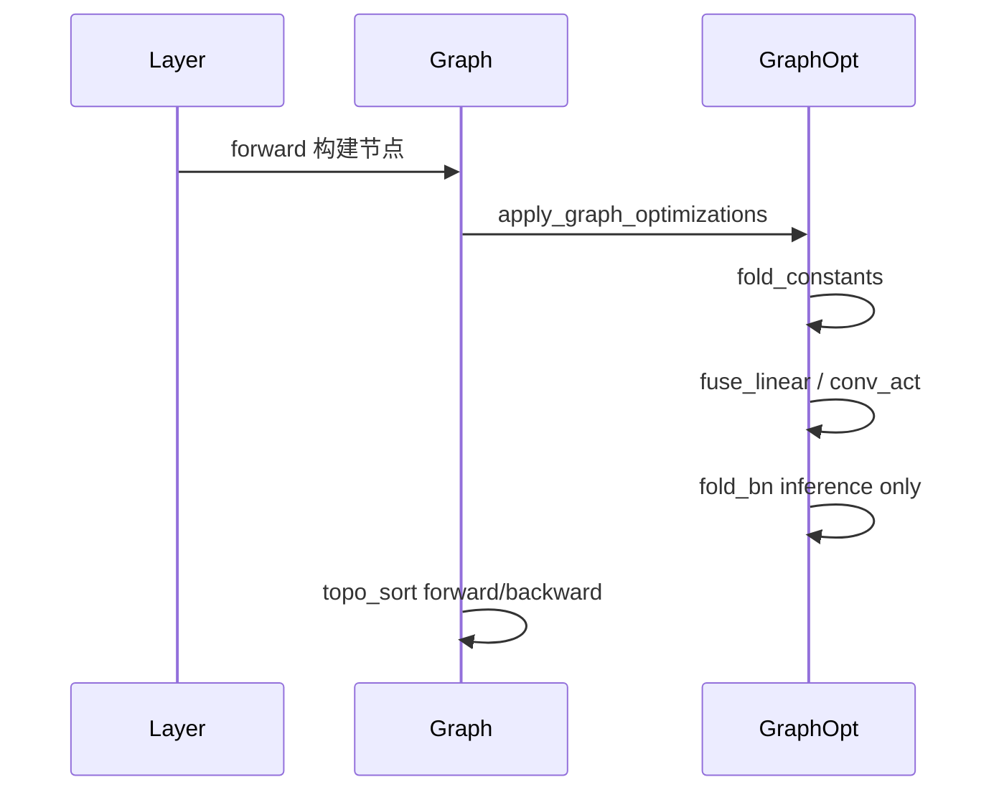
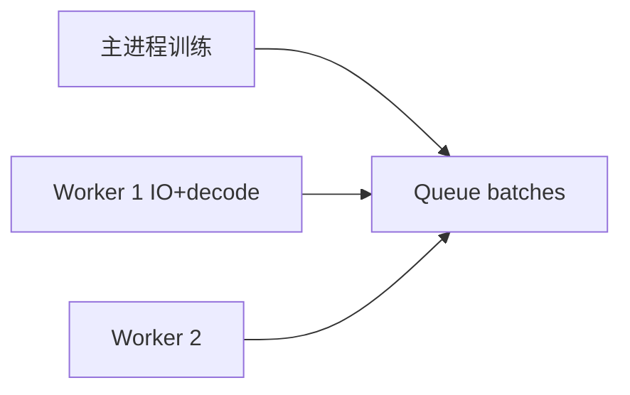

# 详细设计

## 1. TensorBoardLogger

- 路径：`MyFlows/utils/tensorboard_logger.py`
- `log_scalar` / `log_histogram` / `log_text` / `log_figure` / `log_images_grid` / `close()`；缺依赖时静默禁用
- 五层可视化：训练脚本采集数据，`observers/` 计算梯度范数、参数范数、更新比例、激活稀疏度，`training_dashboard.py` 统一 TensorBoard tag 与写入时机，TensorBoard 展示训练总览、梯度页、激活页和解释页。

## 1.1 Grad-CAM

- 路径：`MyFlows/utils/gradcam.py`、`tools/explain_donkey_gradcam.py`
- CLI 编排拆分：`tools/explain/model_factory.py`、`tools/explain/targets.py`、`tools/explain/reporting.py`
- ResNet 回归默认解释 `angle` 输出，VGG 分类默认解释预测类别。
- Grad-CAM 基于 MyFlows checkpoint 离线生成 TensorBoard image 和 PNG，不修改 `proto/infer.proto`。

## 1.2 应用公共数据层

- 路径：`apps/common/donkey_data.py`、`apps/common/image_preprocess.py`
- 作用：统一 catalog/filename 数据索引、图像读取、NCHW 预处理和固定 batch padding
- 使用方：ResNet/VGG 训练、MyFlows/ONNX/VGG 评估、INT8 量化评估、Grad-CAM、DataLoader benchmark

## 2. Checkpoint 格式

- `*.json`：层结构、参数 key、优化器元数据
- `*.npz`：权重 ndarray
- 实现：`checkpoint.py` 负责 JSON+NPZ 保存/加载，`onnx_exporter.py` 负责 ONNX 导出，`serialization.py` 保持兼容导出
- API：`save_checkpoint` / `load_checkpoint` / `export_onnx`

## 3. 构图期优化

- 训练：`Graph(optimize=True)` 默认不折叠 BN
- 推理导出 ONNX 前：`apply_graph_optimizations(..., mode="inference")`

## 4. MultiprocessDataLoader

- 路径：`MyFlows/data/pipeline.py`
- Windows：`spawn` + `if __name__ == "__main__"`
- 训练脚本：`--num-workers`；基准：`benchmark/dataloader_bench.py`

## 5. 部署

- Proto：`proto/infer.proto` → `generated/grpc/infer_pb2*.py`
- gRPC：`python -m apps.serve.serve_grpc --port 50051`
- FastAPI：`python -m apps.serve.serve_fastapi --port 8000`
- 分层：`config.py`、`logger.py`、`metrics.py`、`schema.py` 抽出服务配置、JSONL 日志、延迟/错误率统计和响应解析
- SDK：`grpc_client.py`、`fastapi_client.py` 封装稳定客户端，CLI 只负责参数解析
- FastAPI：统一响应、`X-Request-ID`、结构化日志、`/metrics`
- gRPC：输入校验、结构化请求日志、客户端侧响应解析
- 压测：`benchmark/serve_bench.py --out-json ... --out-md ...`
- Docker：`deploy/docker/docker-compose.yml`

## 6. 依赖

- `MyFlows/requirements-tb.txt`：tensorboard, torch
- `requirements-deploy.txt`：grpcio, onnxruntime, fastapi, uvicorn
- `benchmark/requirements-bench.txt`：tensorflow, matplotlib
