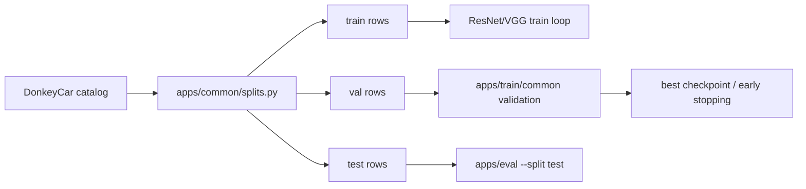
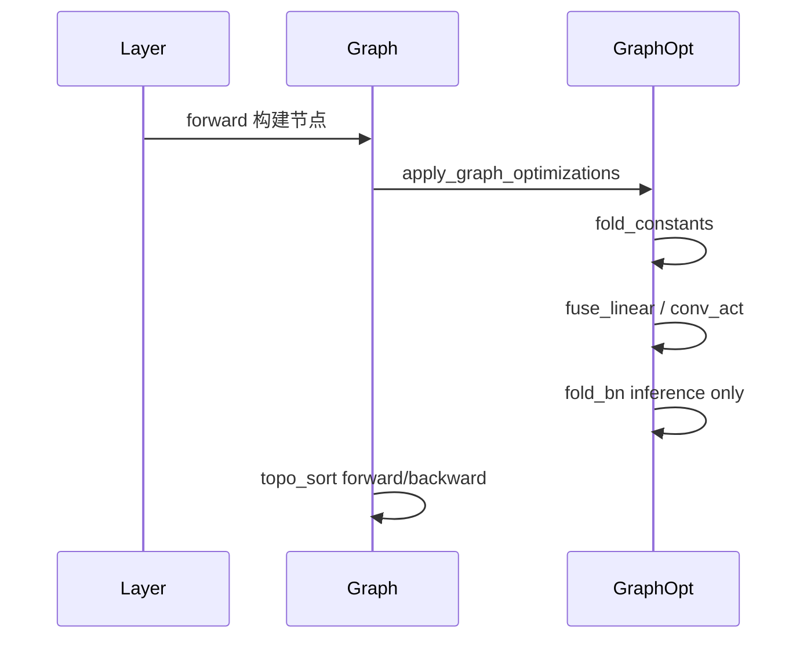
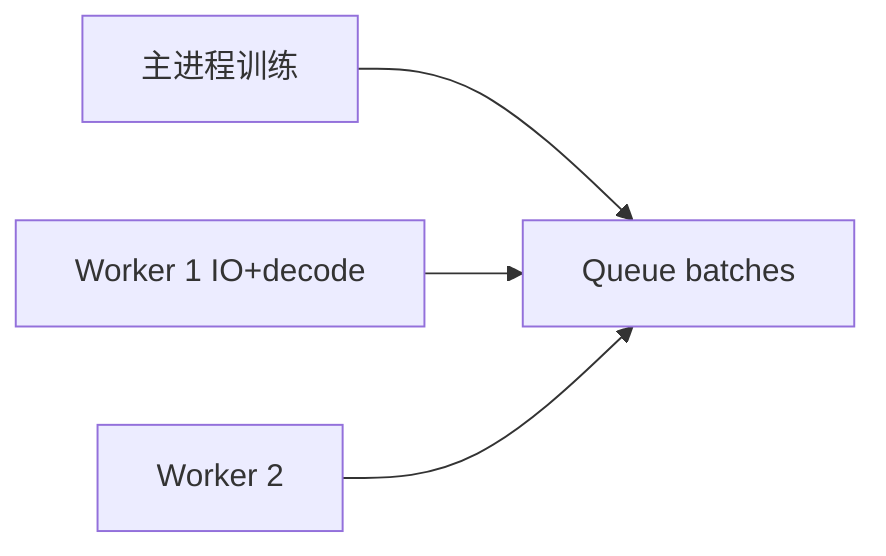

# 详细设计

## 1. TensorBoardLogger

- 路径：`MyFlows/utils/tensorboard_logger.py`
- `log_scalar` / `log_histogram` / `log_text` / `log_figure` / `log_images_grid` / `close()`；缺依赖时静默禁用
- 五层可视化：训练脚本采集数据，`observers/` 计算梯度范数、参数范数、更新比例、激活稀疏度，`training_dashboard.py` 统一 TensorBoard tag 与写入时机，TensorBoard 展示训练总览、梯度页、激活页和解释页。

## 1.1 Grad-CAM

- 路径：`MyFlows/utils/gradcam.py`、`tools/explain_donkey_gradcam.py`
- CLI 编排拆分：`tools/explain/model_factory.py`、`tools/explain/targets.py`、`tools/explain/reporting.py`
- ResNet/VGG 均按 `output_dim=2` 的 `[angle, throttle]` 回归头构建，默认解释 `angle` 输出，也可通过 `--target-output throttle` 切换目标。
- Grad-CAM 基于 MyFlows checkpoint 离线生成 TensorBoard image 和 PNG，不修改 `proto/infer.proto`。

## 1.2 应用公共数据层

- 路径：`apps/common/donkey_data.py`、`apps/common/image_preprocess.py`
- 作用：统一 catalog/filename 数据索引、图像读取、NCHW 预处理和固定 batch padding
- 使用方：ResNet/VGG 训练、MyFlows/ONNX/VGG 评估、INT8 量化评估、Grad-CAM、DataLoader benchmark

## 1.3 可选 Split、验证集与早停

- Split 路径：`apps/common/splits.py`
- 训练控制路径：`apps/train/common/validation.py`、`apps/train/common/training_control.py`
- 设计原则：数据划分属于应用公共层，不依赖模型、优化器或训练脚本内部状态；验证循环、best selection、early stopping 属于训练公共层，ResNet/VGG 只调用公共接口。
- 规则：未设置 `--val-ratio/--test-ratio/--val-size/--test-size/--split-file` 时不启用 split；`--val-size/--test-size` 优先于 ratio；`--split-file` 存在时优先复用，保证训练、评估和报告口径一致。

## 1.4 正则化、Dropout 与初始化

- 正则化路径：`MyFlows/train/regularization.py`
- Dropout 路径：`MyFlows/ops/dropout.py`、`MyFlows/layers/layer.py`
- 初始化路径：`MyFlows/utils/initializers.py`
- 设计原则：Dropout、权重惩罚和初始化都属于 MyFlows 框架层；训练脚本只通过 CLI 传入 `--dropout`、`--weight-decay`、`--l1-coeff`、`--initializer` 等配置，不直接操作参数细节。
- Dropout 由模型的 `train()` / `eval()` 状态控制，训练态启用随机置零，评估态自动关闭。ResNet/VGG 构造器默认 `dropout=0.0`，不启用时保持旧行为。
- 正则化默认只作用于权重参数，跳过 bias/BN；如需课程展示完整控制，可通过 `--regularize-bias-bn` 打开。

## 1.5 训练诊断

- 路径：`MyFlows/utils/model_inspector.py`
- 功能：一次性 model summary、计算图节点 shape 检查、NaN/Inf 检查、全零输出检查。
- 接入方式：训练脚本通过 `--summary-once`、`--check-shape`、`--check-content` 打开；诊断报告写入日志，必要时中止训练，避免无效长跑。

## 2. Checkpoint 格式

- `*.json`：层结构、参数 key、优化器元数据
- `*.npz`：权重 ndarray
- 实现：`checkpoint.py` 负责 JSON+NPZ 保存/加载，`onnx_exporter.py` 负责 ONNX 导出，`serialization.py` 保持兼容导出
- API：`save_checkpoint` / `load_checkpoint` / `export_onnx`
- 部署图入口：`tools/export_resnet_onnx.py` 统一封装 ResNet-18 / VGG-11 checkpoint 到固定 batch ONNX 的构图、加载和导出；训练脚本 `--export-onnx` 调用该工具函数。

## 3. 构图期优化

- 训练：`Graph(optimize=True)` 默认不折叠 BN
- 推理导出 ONNX 前：`apply_graph_optimizations(..., mode="inference")`

## 4. MultiprocessDataLoader

- 路径：`MyFlows/data/pipeline.py`
- Windows：`spawn` + `if __name__ == "__main__"`
- 训练脚本：`--num-workers`；基准：`benchmark/dataloader_bench.py`

## 5. 部署

- Proto：`proto/infer.proto` → `generated/grpc/infer_pb2*.py`
- gRPC：`python -m apps.serve.serve_grpc --port 50051`
- FastAPI：`python -m apps.serve.serve_fastapi --port 8000`
- 分层：`config.py`、`logger.py`、`metrics.py`、`schema.py` 抽出服务配置、JSONL 日志、延迟/错误率统计和响应解析
- SDK：`grpc_client.py`、`fastapi_client.py` 封装稳定客户端，CLI 只负责参数解析
- FastAPI：统一响应、`X-Request-ID`、结构化日志、`/metrics`
- gRPC：输入校验、结构化请求日志、客户端侧响应解析
- 压测：`benchmark/serve_bench.py --out-json ... --out-md ...`
- Docker：`deploy/docker/docker-compose.yml`

## 6. 依赖

- `MyFlows/requirements-tb.txt`：tensorboard, torch
- `requirements-deploy.txt`：grpcio, onnxruntime-gpu[cuda,cudnn], fastapi, uvicorn
- `benchmark/requirements-bench.txt`：torch, paddlepaddle-gpu, psutil, matplotlib
