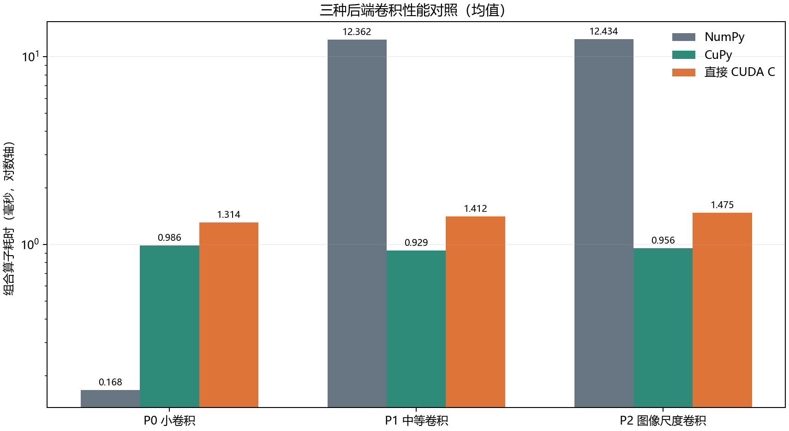
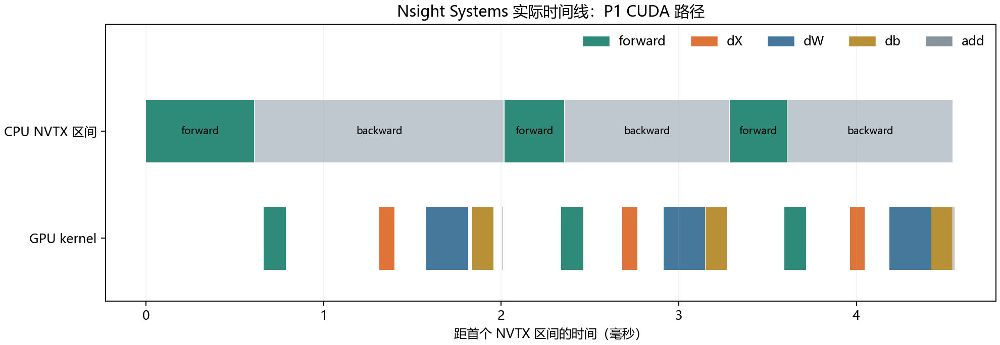

# 第一阶段实验报告：CUDA 算子、CPU PS 与 Nsight

- 日期：2026-09-05；对应 [第一阶段 Spec v0.2](../../../stage1_cuda_ps_spec.md)。
- 范围：C0-C7，第四次课的 GPU 编程、分布式计算和 Nsight；[总体 Spec](../../../semester_spec.md) 继续跟踪后续学期任务。
- 结果：六个自写 CUDA kernel、原图小 CNN、三后端实验、两类 Nsight 和 CPU PS 均有实际运行证据。完整回归连续三次通过，源码在隔离环境和无 Git 的独立目录复现；本地只保留报告、图表和最终 Nsight 原始报告。
- 逐条核对：[acceptance.md](acceptance.md)；已交付的中文数值表和图表在 [analysis/](analysis/tables.md)；历史重建脚本 `analysis/generate_evidence.py` 只有在另行提供原始 run 目录时才能重新计算全部数据。
- 后续优化首轮：[CUDA im2col 路径记录](stage2_im2col_report.md)；它新增独立 backend，不修改本报告的第一阶段结论。
- 历史：源码版本由根仓库和 `MyFlows` 子仓库的 Git 提交记录；实验目录只保留第一阶段正式失败基线、必要的 Nsight 证据和本阶段最终报告，不再生成项目压缩包。

## 1. 验收证据索引

| 门槛 | 实现与验证范围 | 主证据 |
| --- | --- | --- |
| G-BASE | 统一收集原有 78 项框架检查和 21 项应用检查；新增后共 127 项，完整回归三个独立 Python 进程均通过且无 skip | [regression-final-003](regression-final-003/report.md)，三份 tests-N.log、results.json；[基线](c0-baseline-001/report.md) |
| G-CUDA / 数值 | Conv Y/dX/dW/db、Pool Y/dX，CuPy 与原生 C/C++ 两条当前路径；历史失败后端的完整结果另存于基线报告 | [correctness-final-002](correctness-final-002/report.md)；[native_cublas_report.md](native_cublas_report.md)；完整回归日志 |
| G-CUDA / 集成 | 原计算图 100 步小 CNN、相同初值/早期梯度/参数更新、FP32 状态；共享参数/双分支、context 更新、设备变更错误、融合后端保留 | [restored-cnn-001](restored-cnn-001/report.md)；MyFlows/tests/test_cuda_graph_integration.py |
| G-BENCH | P0/P1/P2 Conv、P3 六种 Pool 案例；三后端、四种计时阶段、每组 150 样本；独立冷编译 | [performance-final-004](performance-final-004/report.md) 的汇总结论；[compile-cold-001](compile-cold-001/report.md) |
| G-PROFILE | Systems：P0/P1 的 CuPy 与 CUDA C；Compute：P0/P1 的自写 dX；dX 优化与普通计时对照 | 第 5 节原始 .nsys-rep/.ncu-rep、CSV、SQLite；[优化前](performance-001/report.md) / [优化后](performance-dx-window-002/report.md) |
| G-PS | CPU MLP：1/2/4 worker、16+16 / 20+12；每一步参数/样本数/版本检查；提交、确认、等待、计算、更新计时；四类故障清理 | [1 worker](restored-ps-1-001/report.md)、[2 workers](restored-ps-2-001/report.md)、[4 workers](restored-ps-4-001/report.md)、[20+12](restored-ps-uneven-001/report.md)；第 6 节故障记录 |
| G-REPORT | 正式实验曾记录配置、双仓库状态/实际源码哈希、环境、输入指纹、原始输出与计时；当前交付保留摘要报告、图表、复现命令和汇报提纲 | [隔离回归](isolated-regression-final-002/report.md)、[导出源码正确性](restored-correctness-001/report.md)、本报告 |

测试计数为框架 103 项、应用/交付工具 24 项，总计 127 项。原有旧后端、groups/dilation、ResNet/BN/序列化与应用测试继续执行。连续三次通过是本轮回归证据，不等于所有后续模型或生产场景已经验证。

隔离环境的框架回归共三轮，每轮 102 项通过、1 项旧 TensorBoard 测试因未安装可选 PyTorch 而明确跳过；所有新增 CUDA/PS 检查实际执行。完整 127 项无跳过的记录来自原项目环境，不能混为同一个环境。

## 2. 本阶段实现和修复

| 代码位置（相对项目根目录） | 实际变化 |
| --- | --- |
| MyFlows/ops/cuda_native/native_cublas.cpp | 原生 C/C++ 调度自写 im2col/col2im/max-pool kernel，并调用 cuBLAS 完成卷积 GEMM |
| MyFlows/ops/cuda_native/native.py | 严格数组/设备/shape/dtype 校验、view 连续化、当前 stream 传递和卷积/池化上下文管理 |
| MyFlows/ops/convolution.py、layers/layer.py | 显式 backend=auto/numpy/cupy/cuda_native_cublas；forward 记录实际后端，backward 保持路径并用 += 合并梯度；原接口默认不变 |
| MyFlows/core/graph.py、ops/loss.py、train/opt.py | 小 CNN 梯度种子、交叉熵标签计算和 Adam 状态的 FP32 传播；融合激活继续保留后端/dtype |
| MyFlows/examples/stage1_cnn.py | 固定 seed=0、32 个 8x8 条纹样本；Conv(1→4,k3,p1) → ReLU → Pool(k2,s2) → Flatten → Dense(16) → ReLU → Dense(2) |
| MyFlows/distributed/ | CPU 同步 PS、worker、launcher、协议校验、事件监控、故障注入与有界清理 |
| tools/run_tests.py、MyFlows/tests/ | 收集原先遗漏的 10 个函数式测试；训练测试显式共用带 seed 的初始化器，保留原 loss/accuracy 断言 |
| MyFlows/data/pipeline.py | 修复多 worker 各自组尾批造成批数不稳定的问题；完整 batch 派发、batch_id 重排、加载错误传播与资源清理 |
| benchmark/ 与 tools/restore_stage1_source.py | 正确性/性能/训练/PS/Nsight/冷编译/回归 CLI，失败退出与证据归档，逐文件哈希验证的源码恢复 |

原生路径的算术计算没有委托 CuPy 卷积或 cuDNN。CuPy 仍负责设备数组、分配、连续化和 Python 图层；C/C++ DLL 负责自写卷积/池化 kernel 的 launch，以及卷积中的 cuBLAS 调用。`backend=auto` 在 GPU 上仍使用原 CuPy 路径，必须显式指定 `cuda_native_cublas` 才启用原生算子。

支持范围为 FP32、NCHW 输入、OIHW 权重、groups=1、dilation=1、对称非负 padding、正整数 stride 和非方形卷积核。Pool 为 padding=0、ceil_mode=False。合法非连续 view 会复制成连续数组。有限数值是调用方前提，入口不为检测 NaN 逐次同步扫描。索引为 int32，数组元素数受 int32 上限约束；默认 block=256。FP64、错误设备和不支持配置明确报错。

## 3. 正确性与训练结果

`correctness-final-002` 使用固定的 T0-T4 卷积和 T5 的三种池化；输入、权重、bias、非均匀 dy 均存入 fixture-N.npz 并计算指纹。三后端各自保存 Y/dX/dW/db。CUDA C 在该矩阵的最大绝对误差为 `1.0257513e-5`。

验收使用 `abs(error) <= 1e-4 + 1e-3 * abs(reference)`，相对误差分母为 `max(abs(reference),1e-6)`。P1/P2 大归约中最大绝对误差约为 `4.54e-4` / `6.04e-4`，仍逐元素满足联合容差；不能把单独的最大绝对误差与 atol 比较后判断失败。逐张量绝对/相对误差和 allclose 结果见 [完整数据表](analysis/tables.md)。T6/T7、方向数值梯度、共享参数和 context 检查由测试覆盖，不用随机性能样本代替。

小 CNN 禁用 BN、Dropout、Conv 激活融合和图优化；Adam lr=0.01。CuPy/CUDA C 从完全相同的参数开始，100 次更新后均为：

| 路径 | 训练准确率 | 最终交叉熵 | 参数、梯度、优化器状态 |
| --- | --- | --- | --- |
| CuPy | 100% | 0.001147879520431161 | FP32，通过 |
| CUDA C | 100% | 0.001147879520431161 | FP32，通过 |

初始参数 SHA256 为 `3561ff747d79c8349177cbbcfd2cb66323049c8f6c1e17f6f223ee8d8cf8b434`。fixture、前三步梯度/参数快照和最终参数均归档。该实验验证训练链路和可分小样本过拟合能力，不作为 CIFAR-10、驾驶效果或泛化结论。

## 4. 普通性能实验

正式结果使用 `performance-final-004`。固定 NumPy → CuPy → CUDA C 顺序，串行执行；每案例/后端/阶段先估测、预热 10 次，再采三组各 50 次。九个案例、三后端、四阶段，共 108 组、16,200 个原始样本；总实验约 48.30 秒，无超时或删减案例。P0/P1/P2 形状见 Spec，P3 包含两个输入规模各自的 k2/s2、k3/s2、k3/s1。

CPU 使用 perf_counter；GPU 算子调用使用当前 stream CUDA Events 并等待 stop，同时保存同步 wall time。operator-call 包含分配、连续化、发射、backward 梯度清空/合并；事件间可能存在 Python 提交造成的 GPU 空闲。transfer-inclusive 另用 wall time，包含输入副本、H2D、节点构造、前反向、D2H 输出副本。kernel-only 路径未测；不能把算子调用时间改称 kernel 时间。

下表为前向+反向算子调用的均值 / P95，单位 ms。加速比为参考均值除以 CUDA C 均值，大于 1 表示 CUDA C 较快。

| 案例 | NumPy | CuPy | CUDA C | NumPy/CUDA C | CuPy/CUDA C |
| --- | --- | --- | --- | --- | --- |
| P0 小卷积 | 0.1679 / 0.1770 | 0.9857 / 1.9882 | 1.3138 / 2.0489 | 0.128 | 0.750 |
| P1 中等卷积 | 12.3620 / 14.2589 | 0.9288 / 2.0246 | 1.4122 / 2.3430 | 8.754 | 0.658 |
| P2 驾驶图像尺度合成输入 | 12.4343 / 13.1266 | 0.9558 / 1.9092 | 1.4748 / 2.5064 | 8.431 | 0.648 |



完整 forward、backward、combined、transfer-inclusive 的均值/中位数/P95/数量/加速比，以及六种 P3 池化结果均在 [analysis/tables.md](analysis/tables.md)；原始样本以 timings.csv 为准。P0 的 CPU 计算量小，NumPy 更快；P1/P2 的自写 CUDA 比 NumPy 快，但完整算子调用仍慢于 CuPy。不能据此宣称自写 CUDA 全面更优。

`compile-cold-001` 在新进程和空 CUPY_CACHE_DIR 中实际编译两个 .cu 并取得六个 kernel，冷编译 wall time **415.8437 ms**；随后暖查找为 **2.1208 ms**。使用这两个明确字段；普通 run 的 compile_or_cache_load_wall_ms 可能命中磁盘缓存，不能用来声称冷编译速度。

所有正式性能测试都在本机单 GPU 上串行运行，没有并行启动本任务的另一个 GPU 测试。启动温度、电源读数及驱动保存在各 manifest；本机仍是普通 Windows 桌面环境，未锁频/控制所有后台进程，跨 run 存在方差。GPU 的 P95 明显高于中位数，报告保留所有样本，不把单次最小值作为结论。

## 5. Nsight 观察与优化

### 5.1 可打开的原始报告

| 工具/实现 | P0 小规模 | P1 中等规模 |
| --- | --- | --- |
| Systems / CuPy | [capture.nsys-rep](nsys-P0-cupy-002/capture.nsys-rep) | [capture.nsys-rep](nsys-P1-cupy-002/capture.nsys-rep) |
| Systems / CUDA C 优化后 | [capture.nsys-rep](nsys-P0-dx-window-003/capture.nsys-rep) | [capture.nsys-rep](nsys-P1-dx-window-003/capture.nsys-rep) |
| Compute / CUDA C dX | [capture.ncu-rep](ncu-P0-dx-window-002/capture.ncu-rep) | [capture.ncu-rep](ncu-P1-dx-window-002/capture.ncu-rep) |
| Systems / 优化前 dX | 优化前的 P1 指标已整理进本报告；原始探索目录已清理 | 本报告第 5.3 节 |

六个最终采集目录保留版本、完整 profiler 命令/日志、提取的 CSV、子 workload 的结果/输入、Systems SQLite 以及 `.nsys-rep`/`.ncu-rep`；其他实验的原始日志和快照已清理。采集器检查工具退出码、实际非空报告和期望 kernel 名称；子 workload 通过不能覆盖 profiler 失败。

Systems 捕获三个前反向组合：P0 的 CuPy/CUDA C 分别有 72/21 次 kernel 调用，GPU kernel 总时长 131.616/108.608 us，但 CPU NVTX 总时长分别为 3260.347/4161.105 us。较少 kernel 并没有带来更短的完整调用；结合时间线和 wrapper 源码，可判断主机提交/封装及空闲开销不可忽略。该判断不是把 NVTX 与 kernel 时长之差全部当作 Python 计算。

P1 的 CuPy/CUDA C 分别有 69/21 次 kernel 调用，总 kernel 时长 695.676/1704.754 us；CUDA C 直接归约的计算代价仍然较大。以下图由实际 SQLite 时间戳生成，上方为 CPU NVTX 范围，下方仅绘制 GPU kernels，未绘制传输/memset。



### 5.2 Compute 结果

过滤预热后的 `conv2d_backward_input`，`--set full --launch-count 1`。以下为实际版本的字段，原始 metrics.csv 包含完整指标。

| 指标 | P0 | P1 |
| --- | --- | --- |
| kernel duration | 10.432 us | 86.240 us |
| SM throughput / peak | 1.94% | 62.02% |
| achieved active-warps occupancy | 14.50% | 82.79% |
| DRAM throughput / peak | 3.02% | 9.30% |
| L1/TEX throughput / peak | 13.23% | 64.67% |
| registers/thread | 40 | 40 |
| block size | 256 | 256 |
| waves/SM | 0.02 | 1.78 |

P0 的输入梯度仅发射三个 block，规模不足以充分填满 GPU。P1 的占用和 SM/L1 利用明显升高；DRAM 指标没有达到带宽饱和，不能仅凭这张表将其定性为全局显存带宽瓶颈。更细的指令/停顿分析可在原始报告中继续。Compute/Systems 会改变执行开销，这里的时间只用于各自分析，不并入第 4 节普通计时。

### 5.3 一项实际优化：dX 有效输出窗口

优化前的 dX 为每个输入点遍历 kernel 坐标，在循环内做除法、整除和边界判断。优化后先算出可能贡献的输出窗口范围，再遍历有效位置，保留原来的归约顺序；输入、权重、dy、容差、block size 均不变。优化后的正确性矩阵、数值梯度、小 CNN 和完整回归均通过。

Systems 的 P1 dX 平均耗时从 **608.337 us** 降到 **84.661 us**，约 7.19 倍；同时还有未优化的 dW/db 和封装开销。普通算子计时采用相邻两次完整对照 `performance-001` / `performance-dx-window-002`：

| 案例 | 前反向优化前 ms | 前反向优化后 ms | 自身加速比 |
| --- | --- | --- | --- |
| P0 | 1.269449 | 1.255871 | 1.011 |
| P1 | 1.719162 | 1.187929 | 1.447 |
| P2 | 1.628944 | 1.192942 | 1.365 |

第一阶段的直接卷积失败数据 `performance-final-004` 作为历史基线保留。阶段二已开始处理 dW/db 归约和自写 GEMM；后续只在空闲 GPU 上形成正式成功或失败结论，不再为每次探索保存整份源码压缩包。

### 5.4 工具环境与曾遇到的问题

本机最初没有可用 Nsight。使用 NVIDIA 签名验证为 Valid 的官方 MSI 做便携目录解包，未改动全局工具安装。Windows 长路径导致两次 MSI 管理解包失败，改用短根路径后成功：

- Systems：`D:\ns1s\ProgramFiles64Folder\NVIDIA Corporation\Nsight Systems 2026.4.1\target-windows-x64\nsys.exe`，版本 2026.4.1.191。
- Compute：`D:\ns1c\ProgramFiles64Folder\NVIDIA Corporation\Nsight Compute 2026.2.1\target\windows-desktop-win7-x64\ncu.exe`，版本 2026.2.1.0。

Compute 首次采集出现 `ERR_NVGPUCTRPERM`。用户在 NVIDIA 控制面板允许所有用户访问 GPU 性能计数器后，P0/P1 均实际采集通过，该项当前不再阻塞。早期 `ncu-P0-001` 仅 workload 成功，不能当作有效 Compute 报告；最终包使用经过采集器验证的两份报告。

官方获取和权限说明：[Systems](https://developer.nvidia.com/nsight-systems/get-started)、[Compute](https://developer.nvidia.com/tools-overview/nsight-compute/get-started)、[性能计数器权限](https://developer.nvidia.com/ERR_NVGPUCTRPERM)。工具安装包不放入项目仓库；在新机器应另行安装匹配平台的工具和 NVIDIA 驱动。

## 6. CPU Parameter Server

小模型为 CPU FP64 MLP：4 → Dense(8) → ReLU → Dense(2)，MSE、MBGD lr=0.01，固定 seed=0、global_batch=32、20 步。Windows spawn 创建 server 和 workers。server 是唯一参数/优化器更新者；worker 只上传本地 mean 梯度。server 按 `sum(n_i*g_i)/sum(n_i)` 聚合，并校验 run/worker/step/version/schema/shape/dtype/hash/有限值、重复与陈旧消息。

| workers / shard | 所有 20 步参数最大误差 | PS 整轮 wall s | 同条件单进程 wall s |
| --- | --- | --- | --- |
| 1 / 32 | 0 | 0.465770 | 0.015413 |
| 2 / 16+16 | 5.55112e-17 | 0.508892 | 0.015211 |
| 4 / 8+8+8+8 | 2.77556e-17 | 0.568102 | 0.015770 |
| 2 / 20+12 | 5.55112e-17 | 0.486503 | 0.016179 |

PS 时间包含进程启动、IPC 与清理；单进程包含模型/数据构造和更新历史。它们是单轮演示计时，未进行扩展性能统计。当前小计算量下 PS 明显较慢，不能报告训练加速。每个参数/梯度快照的数组 payload 为 464 bytes；协议头、序列化和底层通信流量未测，不能据此计算网络带宽。

运行时的 events.jsonl 与 timings.csv 分别记录 worker compute、Queue 提交、上传确认等待、参数等待/接收，以及 server 收集、聚合、更新、广播提交、完整 step；当前本地已清理这些原始文件，数值摘要保留在本报告和[汇总表](analysis/tables.md)。提交和确认等待不等同于纯传输。每步样本数与参数版本、初始及全部 20 次更新均与单进程校验。

| 故障 | 真实运行结果 | 清理时间 | 存活子进程 |
| --- | --- | --- | --- |
| [worker 崩溃](ps-fault-crash-001/report.md) | CLI 非零退出，捕获 worker exit 17 | 0.06394 s | 0 |
| [错误 schema](ps-fault-schema-001/report.md) | CLI 非零退出，拒绝 schema_hash | 0.05047 s | 0 |
| [重复梯度](ps-fault-duplicate-001/report.md) | CLI 非零退出，拒绝同 worker/step 重复消息 | 0.04978 s | 0 |
| [超时](ps-fault-timeout-001/report.md) | 10 秒消息超时后 CLI 非零退出 | 0.00726 s | 0 |

故障 run 的 status 正确保留为 `failed`；验收结论是“预期故障被检测且完成清理”，不能把日志改成 passed。额外单元测试覆盖最后一步/单 worker 的重复消息、错误 shape/dtype/非有限梯度、陈旧版本、hash、空 shard 和外部更新前缓存非空。

## 7. 环境、源码与复现

### 7.1 已验证环境

Windows、Python 3.11.7；RTX 4060 Laptop GPU 8188 MiB、驱动 591.74、compute capability 8.9；NumPy 2.2.6、CuPy 14.0.1、CUDA runtime 12.9。自写源码使用 NVRTC 和 `--std=c++11` 编译。

原 `.venv` 继承系统包，用于完整 127 项回归与正式性能。新增 `.codex/stage1-venv` 不继承系统包，未安装 PyTorch，使用锁定的 CuPy `[ctk]` 及 CUDA 用户态库；完成三轮框架回归和导出源码的 CUDA/CNN/PS。CuPy 会提示没有完整 CUDA_PATH，但实际 NVRTC、GPU 测试均成功，提示保留在日志。

根仓库起始 HEAD 为 `76fa7b264b37b407e8223cc9bfe8238c316dab08`，MyFlows 起始 HEAD 为 `50b4f4891aa0471ac69b3582eb44910ce4d4d3ee`。两个仓库均含未提交和未跟踪的工作，HEAD 不能代表本阶段代码。本阶段未提交或重写用户历史；正式 run 记录配置、源码哈希和环境，不再复制源码压缩包。

### 7.2 历史版本与复现

历史代码通过 Git 提交和两个仓库各自的提交记录恢复。第一阶段正式失败基线保留 `performance-final-004`；若要复现新实验，使用当前工作树和新的实验目录，记录 Git 提交、配置、fixture 指纹和环境信息即可。无需复制完整项目，也无需保存 `source-at-run.zip`。

### 7.3 其他入口

以下在项目根执行，输出目录必须是新的名称；GPU 任务串行运行。

```powershell
# 完整回归；隔离环境可用 --scope framework，旧可选 Torch 日志测试会 skip。
.\.venv\Scripts\python.exe -X utf8 -m tools.run_tests --scope all
.\.venv\Scripts\python.exe -X utf8 -m benchmark.stage1_regression --scope all --out-dir docs/experiments/semester_2026_fall/stage1/my-regression-001
.\.venv\Scripts\python.exe -X utf8 -m benchmark.cuda_ops --suite performance --backends numpy,cupy,cuda_native_cublas --seed 0 --out-dir docs/experiments/semester_2026_fall/stage1/my-performance-001
.\.venv\Scripts\python.exe -X utf8 -m benchmark.ps_demo --workers 2 --shard-sizes 20,12 --steps 20 --out-dir docs/experiments/semester_2026_fall/stage1/my-uneven-001
# 此故障演示应非零退出，并生成 failed 结果和清理记录。
.\.venv\Scripts\python.exe -X utf8 -m benchmark.ps_demo --workers 2 --steps 2 --fault crash --out-dir docs/experiments/semester_2026_fall/stage1/my-fault-001
```

Nsight 命令使用本机已验证路径；其他机器须替换 `--tool-path`。将 `--case P1` 改为 P0 可采小规模；Systems 的 `--backend cupy` 可采旧实现。

```powershell
.\.venv\Scripts\python.exe -X utf8 -m benchmark.profile_cuda --tool nsys --tool-path 'D:/ns1s/ProgramFiles64Folder/NVIDIA Corporation/Nsight Systems 2026.4.1/target-windows-x64/nsys.exe' --case P1 --backend cuda_native_cublas --out-dir docs/experiments/semester_2026_fall/stage1/my-nsys-001
.\.venv\Scripts\python.exe -X utf8 -m benchmark.profile_cuda --tool ncu --tool-path 'D:/ns1c/ProgramFiles64Folder/NVIDIA Corporation/Nsight Compute 2026.2.1/target/windows-desktop-win7-x64/ncu.exe' --case P1 --out-dir docs/experiments/semester_2026_fall/stage1/my-ncu-001
# 若另行准备完整原始 run 目录，可重建图表；当前精简交付已直接保留中文图表。
.\.venv\Scripts\python.exe -X utf8 docs/experiments/semester_2026_fall/stage1/analysis/generate_evidence.py --runs-dir docs/experiments/semester_2026_fall/stage1 --out-dir docs/experiments/semester_2026_fall/stage1/my-analysis-001
```

### 7.4 保留的失败与记录修正

工作区保留早期 DataLoader 导致的回归失败、隔离环境缺 matplotlib/OpenCV 的失败和 Compute 权限失败，均不计为验收通过。最终包选入正式通过记录与四个预期 PS 故障；这些早期探索目录不作为最终证据。

早期误差报告采用相对误差分母 `1e-8`；最终正确性/性能改为 Spec 约定的 `1e-6`，并重新执行全矩阵。联合 allclose 容差始终未改。旧回归归档器曾把方法名中的 `not_skipped` 误计入 skips 元信息；最终 `regression-final-003` 修正匹配并重新完整执行三次，明确 `skips=[]`。

## 8. 第四次课汇报提纲与演示

1. **现有卷积如何迁移**：原 im2col+GEMM 保留为对照；展示 `conv2d.cu` 中每线程处理一个结果的映射、四种 Conv kernel 与 Pool argmax 语义。解释 FP32/layout/显式后端限制。
2. **先正确，再比较**：现场运行 correctness（约几秒）；展示 T0 手算、T1 边界、三个后端的误差表及 100 步小 CNN 相同初值结果。
3. **规模与性能**：展示第 4 节图，解释 P0 CPU 更快、P1/P2 GPU 有收益，以及 CUDA C 尚慢于 CuPy；区分 operator-call、transfer-inclusive 与未测的 kernel-only。
4. **Nsight 找原因**：打开 P1 Systems 原始报告和本文时间线，再打开 Compute 的 dX；解释有效输出窗口优化、608→85 us 的内核变化与普通前反向约 1.45 倍的区别。
5. **PS 如何同步更新**：演示 `--workers 2 --shard-sizes 20,12`；用同一步事件说明 worker 本地均值、server 按样本数加权、版本/重复检查。展示 crash 演示非零退出和零残留进程。
6. **本阶段与学期后续**：第一阶段已完成；下一阶段接完整 ResNet FP32/状态接口、PS 小 CNN、完整资源监控与正式应用比较，再继续 Agent。不要把合成小样本或 CPU IPC 演示说成驾驶提升/多 GPU 加速。

## 9. 当前限制

- 没有实现 CUDA C 的 groups/dilation、FP64、Pool padding=1 或 NaN 传播语义；原后端对应能力继续保留。
- 没有完成完整 ResNet/BN 的 FP32 接入、通用 ModelState/TrainRunner/精确 TrainingState；该工作在首次相关训练前继续。
- Nsight 是短算子诊断，尚无完整训练过程的资源峰值/持续采样监控；启动时 nvidia-smi 读数不是峰值。
- PS 是单机 CPU 同步模拟，尚未接小 CNN、GPU PS、All-Reduce 或真实网络性能实验。
- 没有生成新的完整分类、三框架 ResNet 公平比较、DonkeyCar 长训练/闭环或 Agent 结果；历史资产缺失不因此重新列入本阶段。
