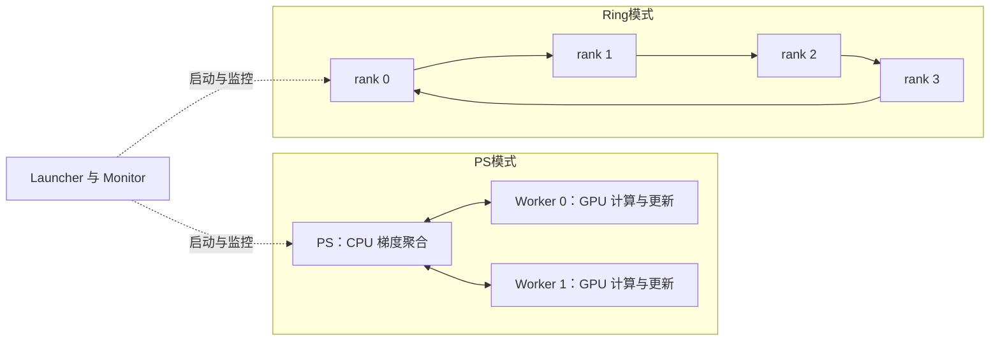

# 第一阶段分布式训练 Spec：单机 GPU PS、Ring AllReduce 与对比评测

> 2026-09-17 执行补充：用户已授权实际完成测试、记录数据和修复问题；中断恢复后又明确加入现有 ResNet18 的 DonkeyCar 道路实验，并要求 PS/Ring 对比统一 gRPC/protobuf。该请求覆盖下文首版“排除完整 ResNet/BN”和小型 CNN 的范围约定。实际选型、BN 处理、冻结配置与实测结果以 [本轮实验协议](experiments/semester_2026_fall/distributed_gpu/20260917/EXPERIMENT_PROTOCOL.md) 和同目录报告为准。下方“仅调整 Spec”是原 v0.3 文档编制范围，不是本次执行限制。

> 2026-09-19 实施结果：本 Spec 已按上述补充范围实施并交付。实现位于 `MyFlows/distributed/`（launcher、ps、engine、worker、ring、transport_socket、transport_grpc、gradient_layout、measurement、monitor、tasks/ 等），protobuf 定义位于仓库根目录 `proto/`，生成代码位于 `generated/grpc/`；正式结果见 [优化版实测报告](experiments/semester_2026_fall/distributed_gpu/20260919_optimized/README.md)：56 个正式档案，质量 14/14、数值 36/36、状态恢复 9/9、故障 17/17、Ring 分块 12/12、通信量 36/36，统一回归 204 项通过。ResNet18 独立整批与分片轨迹的逐步梯度等价未通过，单独保留。道路任务实际使用 ResNet18（base_width=16，BN 统计量冻结），而非下文首版的小 CNN。下文第 3 节“当前事实”与第 13 节“建议位置”记录的是实施前状态。

- 版本：v0.3；已交付（2026-09-19）。保留同步 PS、Ring AllReduce 与双传输评测范围，按用户确认统一为 Worker GPU 更新参数，并保留现有 Adam 更新规则。
- 更新日期：2026-09-16；初稿日期：2026-09-09；实施结果补记：2026-09-23。
- 原 v0.3 编制范围：仅调整本 Spec；不修改实现、其他文档、测试、数据或历史实验。
- 任务依据：[课件 I：概念与参数服务器](<深度学习框架-18 分布式训练-概念与参数服务器架构.pdf>)、[课件 II：Ring AllReduce 与评测](<深度学习框架-18-2 分布式训练II-Ring AllReduce与评测.pdf>)，以及用户关于单机模拟、GPU 原生算子和直接替换不适用实现的说明。下文页码分别标 I、II。
- 实施状态：已实施；验收结论以文首实施结果和第 14 节为准。

## 1. 已确定的范围

老师已明确：受设备限制，完成单机多进程模拟即可。课件 I 第 2、3、29 页也使用这一范围。新课件 II 第 4 页明确要求完整实现 Ring AllReduce，并与 PS 进行对比。因此本任务的正式目标更新为：在同一台 Windows 机器上完成同步 PS 与 Ring AllReduce 两种数据并行训练，接入 GPU，验证训练正确性，并提交同条件评测和瓶颈分析。

用户进一步确定：训练加入 GPU，复用已经迁移的原生 CUDA 算子；先完成课件基础要求；当前不符合要求的内容可以直接修改，不必保留为对比基线。本阶段只完成同步训练，异步 PS 延后；保留现有 Adam 更新规则。PS/Ring 在 CPU 上同步梯度，由各 Worker 在 GPU 上更新参数。

据此，本阶段采用以下边界：

| 项目 | 本阶段决定 |
| --- | --- |
| 物理环境 | 单机多进程；所有训练连接绑定 `127.0.0.1`；多个 GPU Worker 共享本机一张 GPU |
| 角色与拓扑 | PS 模式为 1 个 PS＋N 个 Worker；Ring 模式只有 N 个对等 Worker，无参数服务器；两者共用 Launcher、Monitor |
| 通信 | PS 支持 Socket/TCP＋JSON 和 gRPC＋protobuf；Ring 按课件 II 第 24 页采用 gRPC＋protobuf；全部经本机回环 |
| 并行与同步 | 数据并行、固定全局 batch、同步更新；N=1/2/4，N=1 用于退化路径和等价验证，正式扩展比较以 2/4 Worker 为主 |
| 参数与优化器 | PS/Ring 的每个 Worker 均持有一致的模型参数及优化器状态；取得全局平均梯度后，每步各更新一次；PS 不执行优化器更新 |
| GPU 计算 | Worker 在 GPU 上前向、反向及更新参数/优化器状态；CNN 的 Conv2D/MaxPool2D 显式使用 `cuda_native_cublas` |
| 聚合与更新设备 | PS 在 CPU 上加权聚合并返回平均梯度；Ring 各 rank 在 CPU 上完成两阶段规约；平均梯度 H2D 后统一使用 GPU 优化器 |
| 训练任务 | MNIST＋MLP、小 CNN＋现有 DonkeyCar 道路数据；两项在单进程、PS、Ring 上使用相同任务适配器与配置 |
| CPU 支持 | 同一训练入口提供 CPU 运行和小规模正确性检查；正式 GPU 验收不能用 CPU 通过代替 |
| 替换策略 | 直接改造现有 PS，新增 Ring；旧 Queue/固定合成演示可替换；新建的合规 PS 实验必须留作 Ring 对照 |

本阶段不要求多机、多卡、跨机部署或真实网络扩展性能。单卡共享 GPU 的进程数不能表述成 GPU 数量；增加 Worker 不设“必须加速”的门槛。

课件 I 将 gRPC 列为进阶，但课件 II 第 2 页列出 PS gRPC 评测行，第 24–35 页采用 gRPC 实现 Ring。本稿据此纳入 PS gRPC 适配和 Ring gRPC，并增加同协议的 PS/Ring 对照，避免把序列化差异误判为拓扑收益。PS gRPC 的 4 Worker 配置是为公平对照补充的项目约定。

异步 PS 按用户确认延后，课件 I 第 25、30 页的相关要求登记为后续事项，不作为本阶段完成的前置条件；本阶段的完成结论限定为“同步 PS＋Ring”，不代表异步要求已完成。模型并行、流水并行、Agent、完整 ResNet/BN、自动训练恢复和 NCCL 原生多 GPU 通信不纳入本次；不以调用现成 AllReduce 库替代课件要求的两阶段 Ring 实现。

PS 采用课件 I 第 36–37 页允许的“返回平均梯度、Worker 本地更新”路线。它与 Ring 共用 Worker 优化器路径；PS 负责初值分发、梯度聚合、版本和同步屏障，不维护随训练推进的参数副本或优化器状态。

### 1.1 原生 CUDA 与 CuPy 的实际边界

本 Spec 对用户“就不用 PDF 里的 CuPy”的明确实施口径是：**不再修改卷积和池化算子，直接复用现有的 `cuda_native_cublas` 原生实现。** CNN 的 Conv2D、MaxPool2D 前向和反向都直接指定 `backend="cuda_native_cublas"`，不再另做 CuPy Conv/Pool 算子方案，也不再为本任务迁移、重写或优化这些算子。

这里的“不用 CuPy”仅指不再使用或修改课件中作为算子实现方案的 CuPy Conv/Pool。现有 CUDA/C 原生算子仍需要 CuPy 提供 GPU 数组管理、显存分配、设备指针、连续化和 CUDA stream；Dense、激活、loss 等基础图算子也继续通过框架的 `xp` 数组接口执行。因此本阶段的实际数据流是“CuPy 管理 GPU 数组，现有 C/C++/CUDA kernel 执行 Conv/Pool，cuBLAS 执行卷积 GEMM”。

除非后续另立任务，本阶段不修改 `MyFlows/ops/convolution.py`、`MyFlows/ops/cuda_native/native.py` 或 `native_cublas.cpp` 中已经完成的卷积/池化实现；只在 PS/Ring 的 Worker 训练入口中直接调用它们，并验证实际 backend 没有静默回退。完全移除 CuPy 包属于另一个数组层迁移任务，不是本 Spec 的目标。

## 2. 课件要求与交付映射

| 编号 | 课件依据 | 本阶段交付与检查方式 |
| --- | --- | --- |
| B1 | I 第 2、3、29 页；II 第 7、23 页 | 单机 PS 星形与 Ring 环形拓扑；Launcher/Monitor 支持两模式及 1/2/4 Worker |
| B2 | I 第 2、4、39–42 页；II 第 2、24–27 页 | PS Socket/JSON 与 PS gRPC/protobuf 共用聚合逻辑；Ring gRPC 服务与 protobuf 消息 |
| B3 | I 第 17–18、25、35–37、48–50 页 | PS 同初值、按样本数加权、Pull 返回平均梯度；每个 Worker 每步只更新一次，完整 Push/Pull 与更新确认屏障 |
| B4 | I 第 43、67 页；II 第 35、41 页 | 心跳、限时等待、断连/重复/阶段错误处理；保证可用性、无死锁和失败清理 |
| B5 | I 第 2、4 页；II 第 39 页 | MNIST＋MLP，PS/Ring 收敛、准确率与时间对照 |
| B6 | I 第 2 页；用户要求 GPU；II 第 39 页 | 原生 Conv/Pool 的道路小 CNN 在 PS/Ring 中实际训练；报告回归指标 |
| B7 | I 第 3、4、64 页；II 第 2、4、39–40 页 | 固定格式逐 epoch 表、计算/同步耗时、消息字节、加速比曲线、瓶颈判断及可复算基线 |
| B8 | II 第 4、9–19、31–35 页 | 完整 Split、N−1 轮 ScatterReduce、N−1 轮 AllGather；每 rank 独立更新 |
| B9 | II 第 19–22 页 | 推导 PS/Ring 通信量；明确中心节点、单 rank、集群及收/发口径；理论和实测分开 |
| E1 | I 第 25、30、65 页 | 异步 PS 后续单列梯度陈旧策略与收敛实验；本次只验收同步 |

课件没有给出精度阈值、默认模型、超时具体数值及逐项容差。本文相关数字均为本项目拟采用的验收约定，不冒充教师原文。

## 3. 当前事实与直接改造范围

2026-09-09 硬件检查记录为一张 RTX 4060 Laptop GPU，显存 8188 MiB，驱动 591.74；正式实验重新采集环境，不将这份历史记录当作当日状态。2026-09-16 只读复核确认 `MyFlows/distributed/` 仍为原 Queue/CPU MLP 实现，尚无 Socket PS、gRPC PS 或 Ring 实现。源码主要接入点如下。

| 位置 | 当前事实 | 拟处理 |
| --- | --- | --- |
| [distributed/launcher.py](../MyFlows/distributed/launcher.py) | Windows spawn；通过 Queue 传递参数/梯度；已有退出检测、监控和清理 | 改为启动 Socket 服务与 Worker，加入就绪握手；Queue 可仅承载本机监控事件 |
| [distributed/ps.py](../MyFlows/distributed/ps.py) | 收齐指定 Worker 梯度后，由 PS 聚合和更新 | 改为只聚合并返回平均梯度，优化器更新移至 Worker；服务状态机与传输层分离 |
| [distributed/worker.py](../MyFlows/distributed/worker.py) | 固定 CPU 小 MLP、合成批次、Queue 收发 | 改为任务适配器、CPU/GPU 设备选择及双传输客户端；接入本地优化器和更新去重 |
| [distributed/protocol.py](../MyFlows/distributed/protocol.py) | 已有参数名、shape/dtype、版本、哈希和加权聚合检查 | 迁移到 JSON 消息和统一接口；补定界、响应及重试去重 |
| [distributed/model.py](../MyFlows/distributed/model.py) | 固定 FP64、4→8→2 MLP、MSE、20 步 | 直接替换为所需任务适配；小数组 fixture 仅用于数值测试，不保留旧演示产品分支 |
| [cuda_native/native.py](../MyFlows/ops/cuda_native/native.py) | CuPy 数组/显存/stream 边界；原生 C/C++ 调度 Conv/Pool 和 cuBLAS | Worker 直接使用现有实现；不修改算子，在子进程内初始化并检查真实后端 |
| [examples/stage1_cnn.py](../MyFlows/examples/stage1_cnn.py) | 小 CNN 已使用原生 Conv/Pool；目前与 CPU PS 独立 | 复用构图及 FP32 经验，接入道路训练，不以旧条纹数据替代道路验收 |
| [benchmark/ps_demo.py](../benchmark/ps_demo.py) | 固定演示、逐步数值对照及事件输出 | 直接改造为任务/设备/Worker 数可配置的训练和评测入口 |
| [test_ps_training.py](../MyFlows/tests/test_ps_training.py) | 更新等价、非均匀分片、错误消息、故障清理检查 | 迁移有效断言到新 PS 传输/GPU 路径，并扩展 Ring 独立检查；不要求旧 Queue 入口继续通过 |
| [apps/common](../apps/common) | 已有道路索引、图像预处理及划分工具 | 复用可用部分，补数据指纹、分组划分及 FP32 批次 |
| [train/opt.py](../MyFlows/train/opt.py)、[core/device.py](../MyFlows/core/device.py) | 优化器通过当前设备的 `xp` 接收梯度并更新；Adam 已有本项目的首步状态初始化规则 | 复用现有 GPU 更新路径和数学规则，显式加载平均梯度；不为本阶段修改 Adam 算法 |

2026-09-09 曾重跑 6 项 PS 测试和 4 Worker、20 步演示；最大参数差约 `2.78e-17`。2026-09-16 本次仅更新文档，未重跑该测试；历史结果不能充当本 Spec 的 Socket/gRPC/GPU/Ring 验收结果。

现有 `mycar/data` 下有图像目录、catalog 和 manifest；manifest 标识 `generated-road`，记录索引上限 10000。此信息不等于全部图像已验证可读，也不证明数据来自实车。实施时须建立实际有效样本清单和来源说明。现有 `test_digits_conv.py` 使用 sklearn 的 8×8 digits，不是 MNIST，不能复用其测试结果宣告 MNIST 完成。

审核后允许直接修改上述 PS 实现及其文档、测试、旧实验索引；不要求维持 Queue/Socket 双实现或保留旧 Queue 性能基线。课件 II 第 4 页要求将合规 PS 数据归档供后续对照，所以本期新建的单进程、PS Socket/gRPC 和 Ring 实验必须保留对应配置及原始数据。此要求不意味着继续维护旧演示，也不扩大为清理无关 CUDA 报告、道路数据、模型资产或其他用户工作。

## 4. 两种拓扑与共享训练结构

- **Launcher**：校验配置、准备数据/批次清单；按模式启动 PS＋Worker 或仅 Ring ranks；等待所有监听端口、相邻连接、初始化及预热就绪；统一启动计时并清理。仅协调控制信息，不转发或聚合梯度。
- **PS**：保存只用于启动的参数/状态快照及 schema；管理成员、版本与同步屏障；在 CPU 核验梯度、按固定 Worker 顺序聚合，并缓存不可变的全局平均梯度供 Pull。PS 不执行优化器更新，不持有演进中的模型/优化器状态；只有收齐各 Worker 更新确认后才提交新版本。
- **PS Worker**：持有 GPU 参数与自身优化器状态；读取当前 shard，执行 GPU 前反向，梯度 D2H 后上传；Pull 取得全局平均梯度，H2D 后调用现有优化器一次，完成 GPU 更新并发送确认。
- **Ring Worker/rank**：既监听左邻居请求，又向右邻居发送分块；在 CPU 完成两阶段规约后，将平均梯度 H2D，在本地 GPU 更新参数/优化器一次。训练张量只能沿环传播，不借 rank 0 或 Launcher 集中规约。
- **Monitor**：记录各角色事件、状态、计时和 GPU 总体资源采样；不参与参数传输、梯度聚合或训练屏障判定。监控错误必须留痕，不能静默丢失验收字段。

训练数据通过各 Worker 的本地数据适配器读取；跨进程训练张量必须经过所选的 Socket/JSON 或 gRPC/protobuf。Event/小型 Queue 仅用于 Launcher 生命周期或监控，不可作为张量旁路。三种运行模式共用构图、数据、loss、精度、优化器和评估接口，仅替换梯度同步策略。

首版 PS/Ring 都以主机数组完成通信与 FP32 梯度聚合，随后由 N 个 Worker 分别在 GPU 上更新各自的参数及优化器状态。单进程复用同一 GPU 更新逻辑。各模式的优化器数学规则、设备与状态初始化一致；只替换梯度同步策略，PS 服务进程不增加一份优化器更新。

## 5. PS 服务契约与两种通信适配

### 5.1 两种 PS 传输共用三个训练接口

以下为拟实施的逻辑契约；函数签名可据现有 Python 风格细化，但语义保持一致。

| 接口 | 关键输入 | 响应与同步语义 |
| --- | --- | --- |
| `VariableWeightsInit(request)` | run、worker、协议版本、模型 schema、任务/批次配置指纹 | PS 返回统一初始参数、优化器配置/初始状态、起始版本及指纹；各 Worker 加载并确认一致后才允许训练 |
| `Push(request)` | run、worker、request_id、step/参数版本、batch_id、实际样本数、mean loss、梯度及哈希 | 验证后登记本步唯一贡献，返回已接收状态；该回执不授权 Worker 用本地梯度提前更新 |
| `Pull(request)` | run、worker、request_id、global_step、base_parameter_version、本地已应用的 update_id | 收齐本步梯度后，返回不可变的全局平均梯度、哈希、update_id、base_parameter_version 和 target_parameter_version；没有完成则限时等待或返回明确等待状态；Worker 校验后在 GPU 更新 |

训练接口之外允许 `heartbeat`、`initial_state_applied`、`update_applied`、`round_ready`、`stop` 等控制消息。`update_applied` 包含 update_id、更新后参数版本、优化器步数及参数/状态摘要，表示 GPU 更新已完成。它们不引入第二套梯度聚合通路。

所有请求含 `protocol_version`、`run_id`、`worker_id`、`request_id`、`type`。训练请求另含适用的 `epoch`、`global_step`、`batch_id`、`parameter_version`、`schema_hash`；Pull/更新确认使用的版本字段按上表明确。`update_id` 唯一绑定 `(run_id, global_step, base_parameter_version)`，其目标版本为基版本加一；本地已更新版本与 PS 已收齐确认的提交版本分别记录。所有响应含关联 request_id、状态码及可读错误；错误不得表现为空梯度或普通成功。

拟使用的状态包括：`OK`、`WAITING`、`INVALID_MESSAGE`、`SCHEMA_MISMATCH`、`STALE_VERSION`、`DUPLICATE_CONFLICT`、`WORKER_OFFLINE`、`TIMEOUT`、`RUN_ABORTED`。

### 5.2 Socket＋JSON 编码和定界

1. 每帧为 **4 字节网络字节序无符号长度＋UTF-8 JSON 正文**；长度表示编码后的字节数。
2. 使用完整发送和 `recv_exact` 循环；正确处理拆包、粘包、EOF、部分发送及超时。不能假设一次 recv 对应一条消息。
3. 参数/梯度采用稳定参数名映射，每项含 `shape`、`dtype`、展平的数值数组。首版训练浮点张量为 FP32，明确元素顺序。
4. JSON 不发送 GPU 指针、CuPy 对象或 pickle。序列化拒绝 NaN/Infinity；解码按 schema 重建 FP32 数组，再校验元素数、shape、有限值和哈希。
5. 首版单帧上限暂定 64 MiB，可配置；先检查帧长和 schema 再分配。超过上限明确失败，不静默截断或临时切回 Queue。
6. 记录实际 JSON 正文字节与含长度前缀的应用帧字节。TCP/IP 头、重传等操作系统网络流量不包含在该口径中。

参数 schema 由稳定层级名、shape、dtype 构成，不以对象 id 或可重复的默认名通信。PS 根据共同初始化配置生成并发布参数快照，同时发布现有优化器的初始化规则/状态，不依赖各 Worker 恰好使用相同随机调用次数。新训练的起始版本为 0、Adam 状态字典为空且 t=0，首次更新沿用现有实现；第 12 节从固定 checkpoint 开始的重复实验则分发该 checkpoint 的参数、完整优化器状态及原版本/步数，不能只恢复参数。

### 5.3 一次更新的同步状态机

1. 初始化完成后，所有 Worker 持有同一版本 `v` 的参数及相同优化器状态，且知道同一 global batch 的 shard 分配。
2. Worker 在版本 `v` 上计算本地平均梯度，通过 Push 上传；PS 校验样本清单和实际计数，每 Worker/step 只接收一份有效贡献。
3. 收齐本轮固定成员的贡献后，PS 按 Worker 编号顺序生成一份全局平均梯度及其 update_id，缓存供所有 Worker 拉取；此时只表示梯度就绪，尚未提交参数版本 `v+1`。
4. Worker 通过 Pull 取得同一平均梯度，核验基版本、目标版本、update_id 和内容哈希。未应用过该 update_id 时，将平均梯度 H2D，在训练线程中调用现有优化器一次；确认 GPU 更新完成后，将本地版本推进至 `v+1`、记录已应用 update_id，并发送 `update_applied`。
5. PS 收齐所有 Worker 的更新确认，核对版本、优化器步数及参数/状态摘要一致后提交 `v+1`，发送 `round_ready`，Worker 才开始下一轮计算。最后一轮也必须完成更新确认屏障。

因此既验证更新版本和优化器状态一致，也覆盖课件 I 要求的“所有 Worker 完成 push 与 pull 才进入下一轮”。Pull 返回平均梯度不等于 Worker 已更新完成，PS 不得据此提前放行下一步。

重连重发使用原 request_id：完全相同的已接收 Push 只返回缓存回执，不再次累加；同 worker/step 内容不同的重复请求明确失败。相同 Pull 返回同一 update_id 和平均梯度；Worker 按 update_id 去重，已更新时只补发确认，不再次执行优化器。同一 update_id 内容不同则失败；重复 `update_applied` 只确认，不重复计数。一次更新只在训练线程执行；若 GPU 更新失败或本地应用记录丢失而无法确定是否已更新，则中止该 run，不猜测重放。

PS 缓存的平均梯度、更新确认及 `round_ready` 回执至少保留至本轮所有 Worker 确认，完成记录还须覆盖重连窗口，以支持确认或放行回执丢失后的重试。Worker 在存活进程内保留已应用版本/update_id；旧版本重试只能返回已有完成状态，不能污染新轮次或重新初始化参数。

### 5.4 gRPC＋protobuf 适配

- `ParameterService` 提供相同 Init、Push、Pull 语义；与 Socket 版共用聚合器、状态机、参数 schema、故障策略及模型，不能分别复制两套训练算法。
- protobuf 公共张量结构含名称、shape、dtype、连续数据；首版选择 `bytes` 承载明确小端 FP32 数组，固定布局、校验长度和有限值。它是传输格式约定，禁止 pickle。
- RPC 只负责校验、收发及训练状态机通知；HTTP/2/gRPC 自行定界，不在 protobuf 外再套 Socket 版 4 字节头。源码 `.proto`、生成命令和生成代码版本一起管理。
- 实际记录 `ByteSize()`/序列化正文长度；gRPC framing、HTTP/2 头及重传开销另标未测，不能将正文大小称为实际网络总流量。默认关闭压缩，JSON/protobuf 数值往返均恢复相同 FP32。
- 每次 RPC 带 deadline，保留训练级超时及应用心跳；keepalive 不能代替它们。收发消息大小限制与 Socket 版一致，遇到超限明确失败。
- PS Socket/gRPC 的数据、初值、全局 batch、Worker 数、dtype、optimizer 和计时边界相同，形成传输栈对比；主报告用 PS gRPC 与 Ring gRPC 进行架构对比。

## 6. Ring AllReduce 算法与服务契约

### 6.1 拓扑、初始化和分块

设 `N` 为训练 Worker 数，rank 编号 `r=0..N-1`，左邻居为 `(r-1+N)%N`，右邻居为 `(r+1)%N`。所有节点先监听，再建立右向 gRPC 连接，避免启动顺序死锁。N=1 不连接自己，直接使用本地平均梯度。

rank 0 只在初始化时根据共同配置生成参数及优化器初始状态，或加载本组固定 checkpoint，沿环传递；按第 5.2 节相同规则保留起始版本及优化器步数。所有 rank 验证 schema、初值、学习率、优化器状态与 batch 清单一致后进入训练。rank 0 后续仅承担自身训练及可选的元数据/结束协调，不保存全局梯度缓存或持续广播参数。

按稳定参数名排序构造 `name/shape/dtype/offset/numel` 清单，将本地梯度展平为长度 D 的 FP32 向量。不能只按参数节点数量平均分组，因为各层张量大小不同。令 `C=ceil(D/N)`、`D'=N*C`，尾部补零后分成 N 个等长 chunk；规约后裁掉 padding，再按清单恢复张量。覆盖 D 不能整除 N、D<N 和零值 chunk。

本地梯度为均值 `g_r`，样本数为 `n_r`，本轮总样本数 `B=sum(n_r)` 来自所有 rank 一致的批次清单并逐 rank 校验。先对 `n_r*g_r` 做 **SUM**，AllGather 完成后仅除以 B 一次。等长分片可简化为均值，但实现不能无条件除以 N，也不能在两阶段各除一次。loss 与指标使用同一实际样本计数。

### 6.2 两阶段轮次及更新时点

采用课件中的右发左收方向，轮次 `s=0..N-2`。以下是一套确定的 chunk 编号约定，发送的是当前缓存的完整 chunk：

| 阶段 | rank r 发送的 chunk | 从左邻居接收的 chunk | 接收后的操作 |
| --- | --- | --- | --- |
| ScatterReduce | `(r-s) mod N` | `(r-s-1) mod N` | 累加到对应本地 chunk，每个唯一消息恰好累加一次 |
| AllGather | `(r+1-s) mod N` | `(r-s) mod N` | 用已经完成规约的 chunk 覆盖本地对应位置，不再求和 |

ScatterReduce 的 N−1 轮结束后，rank r 持有完整规约结果的 chunk 为 `(r+1) mod N`。再经 N−1 轮 AllGather，各 rank 拥有全部结果。总计 `2(N−1)` 轮，每轮每 rank 发送 C 个元素、接收 C 个元素。

N>1 时，只有本 rank 收齐本 collective 的所有 chunk、裁剪 padding 并完成一次除 B 后，才能将平均梯度 H2D，调用本地 GPU 优化器一次；N=1 直接使用本地平均梯度。各 rank 使用同一初值、优化器状态和 FP32 更新逻辑，并按与 PS 相同的 update_id 规则防止 collective/控制消息重试造成二次更新。GPU 更新完成后发送 `update_applied`，全员确认参数版本、优化器步数及状态摘要一致才进入下一步；完成屏障只能交换元数据，不能交换完整参数来掩盖更新不一致。

正确性检查须展示 N=2、N=4 的分块流转，另用 N=5 小向量对应课件示例；N=5 只作算法检查，不扩大正式 GPU 训练矩阵。除聚合值外，检查每个 chunk 恰好包含所有 rank 的一次贡献、最终各 rank 参数/优化器状态一致。

### 6.3 Ring 服务、并发与消息检查

按课件 II 第 24–35 页实现 `RingAllReduceService.VariableWeightsInit` 和 `Receive`。服务层经回调或等价的事件投递调用训练器的初始化、scatter、gather 逻辑；不能把图计算、优化器更新放进并发 RPC 处理线程。

`Receive` 消息至少含：`run_id`、`collective_id`、`global_step`、`parameter_version`、`sender_rank`、`receiver_rank`、`stage(INIT/SCATTER/GATHER)`、`round`、`chunk_id`、有效长度、schema/hash 和 chunk 数据。校验来源是否为左邻居、chunk 是否符合轮次、长度/dtype 是否正确，以及当前/允许提前到达的 collective 是否匹配。

- 接收服务和训练线程独立：先校验并存入有界缓冲，立即回执；训练线程在本地梯度和指定消息都就绪时消费。允许正常消息早于本地梯度到达，不能直接对尚未生成的梯度求和。
- 发送与接收可推进，不能全体阻塞在“等待下游完成整个阶段才返回”的同步 RPC 中；等待条件变量时释放锁，避免环状死锁。
- 缓冲仅接受当前 step 及明确限定的一步提前窗口，按 stage/round/chunk 索引；旧步骤消息拒绝或返回已完成回执，任意远期消息不能无限堆积。
- 以完整消息身份及内容哈希去重：相同消息重试只确认、不二次累加；相同身份不同内容失败。AllGather 重复消息同样必须一致。
- `collective_complete` 只表示平均梯度就绪；GPU 更新结束后另发 `update_applied`。这两类消息、参数/优化器摘要、心跳及停止均属于控制信息。元数据协调者可以是 Launcher，但 Ring 的数值聚合始终由相邻 rank 完成。

### 6.4 通信量推导及课件口径说明

统一令 N 为 Worker 数，PS 进程不计入 N；M 为一份原始稠密 FP32 梯度的字节数，本地梯度与全局平均梯度布局相同，暂不含初始化、控制消息、序列化和 padding。集群流量按每条有向传输只计一次，等于所有发送者字节之和；接收者不再重复计入。

| 统计对象 | 发送 | 接收 | 收＋发 |
| --- | --- | --- | --- |
| PS 中心节点，本地梯度上行＋平均梯度下行 | NM | NM | 2NM |
| PS 的单个 Worker | M | M | 2M |
| Ring 的单个 rank | `2(N−1)M/N` | `2(N−1)M/N` | `4(N−1)M/N` |
| 集群有向传输总量 | PS：2NM；Ring：`2(N−1)M` | 不再次加上接收流量 | 与发送总量相同 |

Ring 每 rank 的单向流量随 N 增大趋近 2M，属于关于 N 有界的量，并非严格不变；**全体 rank 的总流量仍随 N 增大**。PS 的主要集中瓶颈是中心节点 NM 上行与 NM 下行。Ring 的轮次为 `2(N−1)`，消息延迟和调度开销仍增长，不能从流量界直接推出实际训练线性加速。

课件 II 第 19 页的 `2(N−1)M/N` 在此对应单 rank 发送或接收的一侧；若同时计收发须乘 2。第 20 页使用 NM，第 21 页 PS 列使用 `2(N−1)M`，未统一 Worker 数与总节点数、单向与双向定义；第 21 页还以 PS 总量比较 Ring 单节点量。本项目采用上表自洽定义，不直接照抄“PS 总量是 Ring 总量 N 倍”。

有 padding 时 Ring 用 `M'=4*N*ceil(D/N)` 代入；初始化、loss/样本数元数据、屏障和错误重发单列。实测分别给出原始数组 payload、JSON/protobuf 正文、各 rank/PS 发送接收及集群发送总量，不能把理论 FP32 字节直接替代实际序列化字节。

## 7. 梯度、数据分片与任务适配

### 7.1 聚合和优化器

PS Worker 上传本地样本平均梯度 `g_i` 与实际样本数 `n_i`；PS 使用 `g = sum(n_i * g_i) / sum(n_i)`。Ring 按第 6 节 SUM 后除 B，得到同一数学结果。MSE 多输出时固定每样本的输出维度 reduction，分类交叉熵按样本平均。

PS/Ring 的外部梯度更新不得再次除以 Worker 数或 batch；各 Worker 调用现有优化器前确保累积缓存为空，显式用全局平均梯度替代本地 shard 梯度。先使用 MBGD 建立单步/多步等价检查；正式训练使用同一配置的现有 Adam，比较参数、全局平均梯度、一阶/二阶状态及更新步数。PS Worker 和 Ring rank 都持有并推进自身的 GPU 优化器状态，PS 服务端不更新这些状态。

按用户确认，保留当前 `MyFlows/train/opt.py` 的 Adam 数学规则，包括首次遇到参数时 `v=grad`、`s=grad²` 及现有后续递推/偏差修正。本阶段不将改为标准 Adam 公式列作前置任务；报告和 manifest 标明使用本项目现有 Adam 实现及代码版本，数值参考使用同一更新规则。新 run、固定 checkpoint 初始化以及 PS/Ring 各 Worker 的学习率、beta、eps、v/s 状态和 t 必须一致；只能在同一全局梯度被应用一次时推进 t。

正式 GPU 路径中，参数、平均梯度及优化器浮点状态均留在 Worker 的 GPU。框架选择 CUDA 后，现有 `xp` 优化器可直接复用；CPU 聚合缓冲使用显式 NumPy 数组，不通过反复切换全局 `set_device` 来执行聚合或更新。CPU 冒烟时整条本地计算/更新路径使用 CPU，同样不改变更新规则。

### 7.2 全局 batch 与尾批

- 固定 seed、划分、每 epoch 排列及 global batch 清单；1/2/4 Worker 只是分拆同一个 batch，不改变训练样本和更新次数。
- 参数 `train_workers` 与 `loader_workers` 分开。首版 `loader_workers=0`，不额外引入读取子进程干扰通信分析。
- 各 Worker 仅读取本轮 shard；索引可共享，但不能每个 Worker 都预先创建一份完整 epoch 的图像张量。
- 明确检查 shard 无交叠、无漏样本，样本数之和等于当前真实 batch。覆盖 `16+16`、`20+12` 和 4 路不整除分片。
- 正式首版采用统一 `drop_last=True`，每个 Worker 配置使用同一全局尾批策略并记录丢弃样本数；训练集不得小于 global batch。非均匀分片用独立有效 batch 验证。
- 不使用复制尾样本填充而把重复样本计为真实样本的处理。后续支持不丢尾批时，另行明确空 shard 协议。

### 7.3 最小任务接口

只抽取当前两个任务和单进程/PS/Ring 所需的能力：`build_model`、`named_parameters`、`load_parameters`、`load_shard`、`forward_backward`、`apply_global_gradients`、`evaluate`，以及本任务所需的参数/优化器状态保存与加载。通过同步策略接口切换 single、ps、ring；同步策略返回完整平均梯度，三种模式均由本地训练线程调用同一 `apply_global_gradients` 完成 GPU 更新。返回值包含 mean loss、梯度、实际样本数及指标累加量。

模型参数名在重复构图、PS 和各 Worker/rank 间一致。首版模型不含 BN、Dropout、随机增强或图融合，以便控制跨 shard 的数学语义；不在此阶段扩展通用训练平台或完整 ResNet 状态管理。

评估固定使用 epoch 末统一参数，由一个指定 Worker/rank 执行，其余等待；PS/Ring 都先确认所有 Worker 的参数及优化器摘要一致，不能仅检查 Worker 0/rank 0。评估时间单列。loss/accuracy/MAE 按实际样本累计，不能平均不同大小批次的均值。评估不更新参数，不访问测试集调参。

checkpoint 由指定 Worker（默认 Worker 0/rank 0）在全员更新确认后保存，PS 只记录已提交版本和 checkpoint 引用。保存内容包含模型参数、完整优化器状态/超参数/实现标识、参数版本、优化器步数和数据进度；Adam v/s 按稳定参数名保存，加载时映射到本 Worker 的变量节点，不能使用进程相关的对象 id。导出的 CPU 快照不得替代训练中的 GPU 状态。任何部分更新或未通过全员一致性检查的步骤都不能发布成功 checkpoint。为固定 checkpoint 的性能重复实验加载状态属于受控初始化，本阶段不扩展为故障后自动恢复训练。

## 8. GPU 接入约定

1. 每个 Worker 在 spawn 子进程内选择 `cuda:0`、初始化自身 CUDA runtime/stream 和模型。Launcher 和 PS 不向子进程传 GPU 指针或已创建的 CUDA 对象。
2. 原生 DLL 由现有构建工具准备。正式训练前逐 Worker 完成原生可用性检查和预热，记录准备时间；测量阶段不并行触发首次编译。缺少依赖、配置不支持或 OOM 均明确失败。
3. CNN 所有 Conv2D、MaxPool2D 直接复用现有 `backend="cuda_native_cublas"`；不修改卷积/池化算子源码，不迁移 CuPy 算子实现。核验实际 forward/backward 路径，禁止 `auto` 静默落到旧 CuPy Conv/Pool。
4. 支持范围沿用已实现的 FP32、NCHW/OIHW、groups=1、dilation=1、Pool padding=0 等限制；模型结构围绕此范围构造。
5. 可训练参数、浮点中间张量、梯度和优化器浮点状态保持 FP32；分类标签与版本/步数使用整数。日志中的主机标量 loss 不等同于训练张量发生 FP64 漂移。
6. PS 数据流为：CPU 读取/预处理 → 输入 H2D → GPU 前反向 → 本地梯度 D2H → JSON/Socket 或 protobuf/gRPC → PS CPU 加权聚合 → 平均梯度返回 → 平均梯度 H2D → Worker GPU 优化器更新 → 更新确认屏障。Ring N>1 的数据流为：同样的读取/GPU 前反向/D2H → CPU chunk 两阶段规约 → 平均梯度 H2D → 各 rank GPU 优化器更新 → 更新确认屏障。两者每步均传出本地梯度、传回平均梯度，参数和优化器状态持续保留在 GPU；不为每个 Ring 轮次额外搬回 GPU。Ring N=1 按本节末尾的退化路径处理。
7. 上传前完成必要的 stream 同步，取得独立主机梯度快照；H2D 后保证平均梯度对更新可见，确认 GPU 更新完成后才记录已应用版本并发送 `update_applied`。心跳/RPC 线程只处理主机控制或收发缓冲，不访问计算图、优化器或 CUDA stream；更新由训练线程串行执行。
8. 多个 Worker 共享同一张卡，各自拥有模型、上下文及工作区；不假定它们的 kernel 会同时执行，也不人为串行化全部正式计算来冒充并行。
9. 在 4 Worker 正式实验前检查显存需求。优先使用本文小模型；如需调整 global batch 或图像尺寸，先统一更新单进程/PS/Ring 整组配置，再重新验证，不只缩小某一种架构或 Worker 数。
10. 原生路径验收需具备设备张量检查、实际 backend 记录和 PS/Ring 各一次小规模 Nsight/等效内核追踪，证明 CNN 原生 kernel 确实在训练 Worker 中运行；同时检查参数、全局平均梯度及 Adam v/s 状态在 GPU，PS 没有执行 optimizer update。Profiler 时间不混入普通性能表，无须重复开展完整算子优化课题。
11. 各 Worker 在本地计算更新后参数/状态摘要，只交换摘要用于一致性确认；为生成摘要而发生的同步、额外 D2H 和耗时单列，并计入 step/epoch。PS/Ring 使用同一摘要方法及检查频率，不将这部分开销隐去。

单进程参考使用同样的 GPU 前反向和优化器更新，直接应用当前全局 batch 的本地平均梯度，不人为增加用于通信的 D2H/H2D。PS/Ring 比单进程多出的梯度设备拷贝、同步及全员确认均计入自身训练时间并单列；报告明确这一基线边界，不能将端到端差异全部解释为网络传输。N=1 的 Ring 退化路径同样直接更新本地 GPU 梯度，不建立环连接；PS N=1 仍走真实 Push/Pull，用于验证协议及其开销。

## 9. 两项训练任务与拟定收敛门槛

第 12.2 节的七个正式配置分别完成下列两项任务；N=1 的 PS/Ring 另用于功能与数值验证，不强制重复完整收敛。所有配置冻结相同数据、超参数和训练预算。

### 9.1 MNIST＋MLP

- 数据：官方 MNIST 28×28 灰度、10 类；训练部分固定划分训练/验证，测试集仅最终报告一次。文件校验和、划分与样本清单进入 manifest。
- 初始候选结构：Flatten(784) → Dense(64) → ReLU → Dense(10)，FP32，CrossEntropy，无 BN/Dropout。
- 初始候选配置：Adam、lr=0.001、global_batch=128、seed=0、10 epochs；先做小预算单 Worker 确认可训练，再冻结正式配置。
- GPU Worker 的 MLP 通过当前框架 GPU 基础算子执行；MLP 没有 Conv/Pool，因此不能单独证明原生卷积接入，B6 负责该项。
- 拟定训练门槛：单进程及两种 PS 传输、Ring 的 2/4 Worker 均完成完整训练，最终验证 accuracy ≥95%，训练 loss 有明确下降；各分布式配置与单进程的验证准确率差不超过 1 个百分点。

上述数值为项目验收目标。若候选配置未达到目标，先基于训练/验证集诊断并统一修订正式配置，再重跑相关组合；不在已得到结果后降低阈值来宣告通过。

### 9.2 小 CNN＋DonkeyCar 道路数据

- 优先使用现有 `mycar/data` 的实际可读图像与 catalog；先核验来源、无效记录、重复图像、angle 范围及 throttle 分布。数据规模以有效 manifest 为准。
- 输入采用现有预处理约定：RGB、归一化到 [0,1]、FP32、NCHW，初始尺寸 H=120、W=160。
- 初始候选结构：Conv(3→8,k5,s2,p2) → ReLU → Pool(k2,s2) → Conv(8→16,k3,s2,p1) → ReLU → Pool(k2,s2) → Flatten(1120) → Dense(32) → ReLU → Dense(2)。Conv/Pool 均为原生 CUDA。
- 输出沿用 `[angle, throttle]`，MSE；如 throttle 为常数，单独报告其性质，主要可学习质量以 angle 指标判断，不能让常数 throttle 掩盖转向误差。
- 初始候选配置：Adam、lr=0.001、global_batch=32、seed=0、20 epochs；资源和可训练性预检后冻结。
- 划分优先按采集 session/序列分组；当前 generated-road 如没有可信分组元数据，使用稳定来源编号分段并明确划分限制。重复图像不可跨集合；不直接把相邻或重复帧随机拆散后声称泛化。
- 拟定训练门槛：单进程及两种 PS 传输、Ring 的 2/4 Worker 均完整训练；固定训练集评估 loss 相对未训练初始化下降至少 30%；验证 angle MAE 比“仅用训练集 angle 均值预测”的常数参考至少低 10%。
- 各分布式配置验证 angle MAE 与单进程的差异不超过 `max(1e-3, 单进程 MAE 的 5%)`。同时保存 loss、angle MAE/RMSE 和 throttle 指标，不只展示少量预测图片。课件表中的 accuracy 在此替换为回归指标，不人为定义一个无法解释的“道路准确率”。

数据预检若不能形成有效训练/验证划分，B6 标为受数据条件限制，不用条纹图、sklearn digits 或重新造出的合成数组替代完成状态。此处验证离线道路学习与分布式链路，不将其结论扩展为真实驾驶闭环性能。

## 10. 心跳、重连与故障语义

- Worker 通过独立控制通道发送应用心跳，默认间隔 1 秒。PS 跟踪 Worker；Ring 的邻居服务与 Launcher/Monitor 跟踪各 rank，默认超过 5 秒未见心跳判为离线。两种传输均保留应用检测，不能只依赖 gRPC keepalive。
- 心跳接收不能被正在等待梯度/Pull 的训练处理器阻塞。正常慢 Worker 可继续心跳，但不能因此无限延长训练 step 的独立 deadline。
- PS 采用课件 I 第 43 页的“等待重连”路线：离线后冻结受影响同步轮次，保留已接收梯度、已生成的平均梯度/update_id、Worker 更新确认和已提交版本，默认等待重连 10 秒；成员及有效 batch 不悄悄改变。
- 活着的 Worker 连接恢复后以相同身份、版本、request_id 及已应用 update_id 重新握手。若尚未应用本步梯度，PS 返回同一平均梯度，Worker 按第 5.3 节校验后更新一次；若本地已经更新，只补发 `update_applied` 或重取 `round_ready`，不再执行优化器。若 PS 已提交本步，重试仅返回已有完成状态；与该提交矛盾的本地状态须报错，不能通过再次初始化或下发参数覆盖来掩盖问题。
- Ring 的临时 RPC 断连可在同样的 10 秒窗口重试原 collective/stage/round/chunk，收发缓存保持不变，并按第 6.3 节去重；GPU 更新完成后的确认重试同样检查已应用 update_id，不再次更新。任一 rank 崩溃、缓存或应用记录丢失、重试超时或协议冲突时整轮失败；不能减少环成员继续规约，也不能用中心化汇总补齐结果。
- 超过重连窗口、Worker 真正崩溃或 PS 退出而无法完成协议时，本轮训练失败，广播停止并由 Launcher 清理。首版不自动重启 Worker、PS 或 Ring rank，也不恢复整个训练 checkpoint。PS/Ring 中可能已有部分 Worker 本地更新的失败步骤均不得作为成功 checkpoint 发布。
- 普通请求和同步 step 的默认上限分别暂定 30 秒、120 秒，和心跳阈值分开；GPU 预热有独立启动时限。正式配置按小任务预检冻结。
- 从决定中止起，5 秒内完成本轮子进程、Socket 与事件通道清理；失败记录保留原因、步骤、Worker、最后版本和退出码。

共同故障检查包括正常长计算期间心跳持续、心跳失联、重连恢复/超时、Worker 崩溃、相同请求重发、冲突重复、错误 schema/shape/dtype、非有限值及过期版本；还须覆盖 GPU 更新前断连、更新完成但确认丢失、`round_ready` 丢失、重复 update_id 和更新结果不确定时中止。Socket 额外覆盖拆包/粘包/半帧断连，PS 覆盖 PS 崩溃、重复 Pull 及最终更新确认断连；Ring 额外覆盖消息先于本地梯度到达、错 phase/round/chunk/邻居、重复累加、Scatter/Gather 中途掉线、rank 0 退出及阶段超时。

协议错误通常直接失败；只有明确可重试的连接故障进入重连流程。失败 run 保留 `failed`；“预期失败被正确检测”的测试通过不改变训练 run 的失败状态。

## 11. Monitor 与计时口径

### 11.1 必须记录的字段

本机进程使用同一类单调时钟记录事件，关联 run、mode、transport、Worker/rank、epoch、step、batch、基版本/目标版本、update_id 和 request_id；Ring 另记录 collective/stage/round/chunk。GPU 前反向及优化器阶段使用 CUDA Events 并正确同步；主机 wall time 同时记录。

| 类别 | 必须记录的内容 |
| --- | --- |
| Worker 计算与更新 | 数据读取/预处理、输入 H2D、forward、backward、本地梯度 D2H、平均梯度 H2D、GPU optimizer update、摘要生成/额外拷贝、更新确认等待、完整 step wall time |
| 序列化 | 本地梯度/平均梯度/chunk encode、decode 耗时；JSON/protobuf 正文与已知应用 framing 字节数；初始参数/状态传输单列 |
| 传输与接口 | 请求往返、收发完成时间；发送/接收字节分别累计；重发和控制消息单列 |
| PS | 收集等待、梯度验证/加权聚合、平均梯度编码/发送、各 Worker 更新确认及版本提交、完整 step；不记录不存在的服务端 optimizer update |
| Ring | flatten/padding、ScatterReduce、AllGather、每轮收发和等待、chunk 累加、裁剪/还原、rank 更新完成屏障；GPU update 与 Worker 更新字段共用同一事件，不重复计时 |
| epoch | 样本数、更新数、训练时间、评估时间、吞吐量、loss/评估指标、各 Worker 状态与阶段汇总 |
| GPU 资源 | 设备名与共享方式；默认 1 秒间隔采样利用率、总显存使用、温度和功耗；记录采样间隔与失败 |
| 生命周期 | 启动、数据准备、编译/预热、正式训练、评估、checkpoint、清理分别计时 |

### 11.2 统一比较边界

课件 II 第 39 页将梯度同步视为通信阶段，而课件 I 第 64 页还要求观察纯通信。报告区分梯度同步、GPU 更新和传输子项，不能使用同一个字段混指它们：

- **计算图时间 `graph_compute_s`**：每 Worker 的 GPU forward＋backward 完成时间；数据准备、设备拷贝、GPU 优化器和评估另列。
- **梯度同步时间 `gradient_sync_s`**：从本 Worker 的本地 CPU 梯度快照就绪，到完整全局平均梯度在该 Worker 的 CPU 上就绪。PS 包含编码、上传、等待、加权聚合、Pull 返回和解码；Ring 包含 flatten/padding、两阶段交换、规约、等待、裁剪/还原和除 B。两者使用相同起止含义，主表“通信用时”列标为“梯度同步，含聚合/等待”；不含梯度 D2H、平均梯度 H2D、GPU 更新或更新确认屏障。
- **GPU 更新 `optimizer_gpu_s`**：平均梯度在 GPU 上就绪后，调用现有优化器至本次参数及优化器状态更新完成的 CUDA Event 时间；配套记录主机 `optimizer_wall_s`。平均梯度 H2D 另计，不能将优化器耗时并入通信列。
- **更新后确认 `update_confirm_s`**：GPU 更新完成后，到本 Worker 完成摘要生成、确认交换并收到全员放行的主机时间；包含摘要所需的同步/额外拷贝及等待，子项单列。
- **同步至更新完成 `sync_update_s`**：从本 Worker GPU 反向完成，到本 Worker 收到本步全员更新放行。该主机 wall time 包含梯度 D2H、梯度同步、平均梯度 H2D、GPU 更新及更新确认，作为端到端辅助字段，不能直接标为通信时间。单进程和 Ring N=1 以本地 GPU 更新完成为终点，没有跨进程梯度同步/确认，这些阶段记为 0；本地更新耗时照常记录。
- **原始 collective 时间**：Ring 从待规约向量就绪到平均梯度就绪；PS 分别保留 Push/Pull RPC 及服务端聚合事件。阶段细分用于解释 `gradient_sync_s`，不得与该字段重复累计。
- **传输子项 `transport_observed_s`**：完成序列化后的发送、接收和回执观测时间；显式服务端处理、训练屏障、encode/decode、H2D/D2H 单列。gRPC 自动编解码/框架调度若无法完整拆开，字段明确标为 RPC 复合时间，纯传输填未测而非零。
- **epoch 时间 `epoch_train_wall_s`**：所有 Worker 对该 epoch 就绪后，到最后一步 GPU 更新及全员更新确认屏障结束。包括训练中的数据读取、计算、梯度拷贝/同步、优化器更新、摘要及确认等待；不含进程启动、初始参数/状态分发、预热、验证和保存。另存含评估与保存的总时间。

本机时间戳仍包含操作系统调度和回环栈开销，不解释为物理网络线路延迟。通信微测量须使用同样消息格式与大小，并单列为微测量，不能替代训练中的同步等待。

各进程阶段可能重叠；不能把所有 Worker 时间直接相加当作 epoch wall time。每 Worker 阶段累计和分布均保留，主表分别使用本 epoch 各 Worker 累计计算时间、梯度同步时间、GPU 更新时间的最大值，并标记此聚合方式；它们不保证相加等于 epoch 时间，也不能互相相减当作其他阶段。GPU 采样峰值与运行时分配峰值区分，单卡使用不重复算成各 Worker 独占使用。

## 12. 正式对比矩阵与交付图表

### 12.1 控制变量与重复实验

1. 同一任务固定数据/划分、初始参数/优化器状态、epoch、global batch、优化器实现及超参数、GPU 更新设备、预处理、原生 backend 和批次顺序。
2. 运行第 12.2 节的单进程、PS Socket、PS gRPC、Ring gRPC；固定 N 比较架构，固定架构/N 比较传输栈。不得将弱扩展或不同优化器设备混入主表。
3. 至少 3 次独立进程重复测量，启动/预热与稳定训练分开；不同配置串行运行，轮换 Worker 数测试顺序。
4. 每个正式配置至少完成一次全预算收敛训练。重复性能实验可从同一固定 checkpoint/优化器状态、相同数据排列开始，至少测一个完整 epoch；重复至少 3 次，整组使用相同区间，不能替代收敛验收。主表标记训练质量与性能结果各自的 run_id/epoch，避免混用未说明的区间。
5. 报告 epoch/step 中位数、P95、吞吐量、消息体积、通信/等待占比和样本数。正式监控默认开启；另用短配对实验测其开销。
6. 按课件定义 `S_mode(N)=T_single/T_mode(N)`，`E_mode(N)=S_mode(N)/N`；T 使用同任务、同区间的 epoch_train_wall_s 中位数。单进程 S=1；可另报 PS/Ring 的 N=1 开销，但不替换主基线。
7. 绘制同一任务的 PS Socket、PS gRPC、Ring gRPC 实测曲线与 `S_ideal(N)=N` 参考线，展示误差范围及差距。共享一张 GPU 时参考线仅为课程理想扩展示意；E 是按 Worker 数归一化的描述，不是多 GPU 利用率。
8. 不预设 Ring 一定更快，也不将课件的线性增长/实测小于 N 简化表述作为数值通过条件。根据 CPU 梯度聚合、GPU 更新、编解码、H2D/D2H、消息轮次、摘要/确认等待、数据加载和单卡竞争判断瓶颈；出现异常超线性先复核计时、缓存及配置。
9. 课件 II 第 22 页的“通信超过三成”作为分析提示；报告明确占比的分母和是否含更新/等待，不把 30% 设为换架构或验收的硬阈值。

CPU 只需同入口冒烟和必要数值检查，不把完整 CPU 长训练与 CuPy/原生算子对比扩展成另一套必交矩阵。正式 GPU 矩阵遇到不支持/OOM 必须记失败，不能自动回退 CPU。

### 12.2 最低正式实验矩阵

下表对 MNIST MLP、道路 CNN 分别执行，均使用单机共享 GPU 前反向和 GPU 参数更新；分布式配置在 CPU 上同步梯度，设备拷贝边界按第 8 节记录。1 Worker 的 PS/Ring 在数值和启动测试中覆盖；它们可加入性能表，但不增加本表的完整训练必交组合。

| 配置 ID | 模式/传输 | Worker 数 | 目的 |
| --- | --- | --- | --- |
| single-1 | 单进程、无网络 | 1 | 数值与时间基线，S=1 |
| ps-json-2 | PS Socket＋JSON | 2 | 课件 I 及 II 第 2、4 页 PS 评测 |
| ps-json-4 | PS Socket＋JSON | 4 | 4 Worker 收敛与扩展效率 |
| ps-grpc-2 | PS gRPC＋protobuf | 2 | 双传输对比；课件 II 第 2 页指定行 |
| ps-grpc-4 | PS gRPC＋protobuf | 4 | 与 Ring 4 Worker 保持同传输协议的项目补充 |
| ring-grpc-2 | Ring gRPC＋protobuf | 2 | 与 PS gRPC 2 Worker 对比 |
| ring-grpc-4 | Ring gRPC＋protobuf | 4 | 与 PS gRPC 4 Worker 对比 |

主架构结论来自 `ps-grpc-N` 与 `ring-grpc-N`；`ps-json-N` 与 `ps-grpc-N` 用于传输栈比较。Socket PS 与 gRPC Ring 的端到端差异也可展示，但同时改变了协议和拓扑，不能归因于其中单一因素。

### 12.3 必交结果

1. **逐 epoch 固定格式表**：至少含 run_id、task、mode、transport、N、seed、epoch、global_batch、sample_count、epoch_train_wall_s、graph_compute_s、gradient_sync_s、optimizer_gpu_s、optimizer_wall_s、update_confirm_s、sync_update_s、本地梯度 D2H/平均梯度 H2D 子项、tx/rx 正文字节、S、E、loss、accuracy 或 angle MAE/RMSE；关联统计方式、checkpoint、优化器实现及数据指纹。通信用时使用 gradient_sync_s，GPU 更新与确认时间各自列出。
2. **不少于三组的 PS 评测**：单进程、Socket PS 2/4 Worker，加 gRPC PS 2/4 Worker；均列计算/同步时间和消息体积，不以理论数字填实测栏。
3. **PS/Ring 同条件表**：固定 N 与 gRPC，比较时间、质量、发送/接收流量和梯度同步阶段；标明 PS 额外 CPU 聚合服务进程，以及两模式都由 N 个 Worker 执行各自的 GPU 优化器更新。
4. **加速比曲线**：每个任务标出实测、重复实验范围、理想 N 线，以及单卡模拟条件；至少涵盖 N=1 基线和 N=2/4。
5. **机制与瓶颈说明**：Ring 分块流转示例、通信量推导、至少一条实际 step 时间线，解释主瓶颈与线性参考差距。JSON 编解码慢不能直接称为 PS 拓扑瓶颈。
6. **可复算的固定格式归档**：保留本期合规 PS 基线、Ring 对照、重复 runs 和失败记录。以后修改任一控制变量应形成新实验组，不覆盖原有对照数据。

## 13. 实施批次与拟调整文件

| 批次 | 实施内容 | 完成证据 |
| --- | --- | --- |
| S0：共同接口与任务准备 | mode/transport 配置、JSON/protobuf schema、稳定参数布局、数据清单、统一初始参数/优化器状态和 update_id 规则 | CPU 数值参考、平均梯度消息往返、共同配置/状态指纹 |
| S1：PS 双传输 | Socket 同步 PS；共享状态机的 gRPC 适配；Pull 返回平均梯度、Worker 更新确认、心跳、重连和清理 | 双协议 1/2/4 Worker 更新等价；Push/Pull/更新确认重试不重复聚合或更新 |
| S2：GPU 与 PS 基线 | 接原生 Conv/Pool、Worker GPU 优化器、状态保存/加载、两项任务、epoch 评测及重复计时 | 设备/FP32 证据、全员状态一致的 checkpoint、合规单进程/PS 基线归档 |
| S3：Ring 算法与服务 | Split、两阶段轮次、gRPC 收发线程/缓冲、阶段去重、各 rank 更新 | N=1/2/4/5 小向量、padding/加权检查；N=1/2/4 训练更新等价 |
| S4：Ring GPU 与故障 | 同一任务适配器和 GPU 更新路径接入 Ring；实际后端追踪、更新去重、故障矩阵、两任务训练 | 2/4 Worker 收敛、各 rank 参数/状态一致、无死锁和零残留 |
| S5：联合评测与交付 | 执行第 12 节矩阵、公式/流量核对、曲线与瓶颈分析 | B1–B9 验收、固定格式数据、复现命令及更新后的范围说明 |

已有文件直接改造：[MyFlows/distributed](../MyFlows/distributed)、[benchmark/ps_demo.py](../benchmark/ps_demo.py)、[PS 测试](../MyFlows/tests/test_ps_training.py)。拟按职责增加 `transport_socket.py`、`transport_grpc.py`、`ring.py`、`gradient_layout.py`、`monitor.py`、任务适配及 `proto/common.proto`、`proto/ps.proto`、`proto/ring.proto`；Ring 算法及训练测试独立组织。（2026-09-19 补记：上述文件均已实现，proto 实际放在仓库根目录 `proto/`。）

正式入口拟为统一 `benchmark.distributed_train` 与 `benchmark.distributed_compare`，配置选择 `mode=single|ps|ring`、`transport=none|socket_json|grpc_proto`、task、train_workers、device、dtype、global_batch、seed、epochs、out_dir。合法组合为 single/none、ps/两种传输、ring/grpc_proto；Ring Socket 不在本次范围。旧 ps_demo 可迁移或保留轻量转发，不要求维护两套训练循环。

数据适配优先复用 [donkey_data.py](../apps/common/donkey_data.py)、[image_preprocess.py](../apps/common/image_preprocess.py)、[splits.py](../apps/common/splits.py)，补齐与本任务相关的缺口；不为两个模型先重构所有应用训练器。

实施时允许移除被替代的固定演示、过期 PS 报告及失效链接，将有效数学/故障断言迁移到新实现。最终再同步 [第一阶段 Spec](stage1_cuda_ps_spec.md)、[总体 Spec](semester_spec.md) 和阶段验收说明，清除“Queue CPU 演示等于新课件全部完成”以及本任务仍将 All-Reduce 排除在外的过时表述。本轮只改本文；其他文件与本任务范围冲突时，以本文 v0.3 的安排为准，不据此声称已经完成实现。

## 14. 验收清单

2026-09-19 按 [优化版实测报告](experiments/semester_2026_fall/distributed_gpu/20260919_optimized/README.md) 与 `delivery_summary.json` 勾选；括号内为限定说明。

- [x] G-SCOPE：两模式实际在单机回环运行；PS 为 N＋1 个训练相关进程，Ring 为 N 个 rank，无 PS；标注共享单 GPU。
- [x] G-PROTOCOL：PS Socket/JSON、PS gRPC/protobuf、Ring gRPC/protobuf 的实际消息、定界/状态、deadline 可验证；无 Queue 张量旁路。
- [x] G-PS-SYNC：两种 PS 传输同初值/优化器状态；PS 只聚合，Pull 返回全局平均梯度，各 Worker 每步只更新一次；Push/Pull 与 GPU 更新确认屏障完整，重复请求不重复贡献或更新。
- [x] G-RING：真实相邻收发；Split、N−1 轮 ScatterReduce、N−1 轮 AllGather 完整；N=1 退化、N=2/4/5 算法、padding、D<N、提前消息与去重通过；无中心梯度聚合。
- [x] G-NUMERIC：单进程与三种分布式实现的 N=1/2/4，按本项目现有优化器规则在单步和连续 20 步比较全局平均梯度、所有参数、优化器状态及步数；PS/Ring 检查每个 Worker，覆盖不等分片和非整除向量。（数值检查 36/36 通过；ResNet18 独立整批与分片的逐步梯度等价未通过，单列为未完成项。）
- [x] G-GPU：PS/Ring 的 GPU 1/2/4 Worker 实际执行；CNN Conv/Pool 均为原生路径，参数、平均梯度和优化器浮点状态在 GPU，具备设备/FP32 证据及各一次内核追踪；PS 不执行 optimizer update。
- [x] G-FAULT：共同故障及 Ring 阶段/邻居/中途掉线覆盖；重复平均梯度、更新确认和放行消息不导致二次更新，部分更新/状态不确定时整轮失败；中止后 5 秒内清理，无死锁、重复累加、成员悄悄缩减或失败步骤发布成功 checkpoint。（17/17）
- [x] G-STATE：PS/Ring 全员参数及优化器状态/步数一致后，由指定 Worker 保存 checkpoint；受控加载包含完整参数、优化器状态与版本/步数，后续更新与未中断参考一致；不要求故障后自动恢复。（9/9）
- [x] G-MNIST：第 12.2 节完整矩阵达到第 9 节 MNIST 门槛，包含验证和最终测试结果。
- [x] G-DONKEY：同一矩阵的原生 CNN 达到道路任务门槛；来源/划分限制和 angle/throttle 指标明确。（实际模型为 ResNet18，base_width=16，BN 冻结。）
- [x] G-MONITOR：step/epoch/rank/stage/update_id 指标、tx/rx 字节与计时边界齐全；gradient_sync_s、梯度拷贝、GPU 更新、摘要/确认等待分开，正文与网络总流量、纯传输与同步等待可区分。（GPU 资源为整卡 nvidia-smi 约 1 秒采样，不能区分单个 Worker。）
- [x] G-VOLUME：按第 6.4 节自洽推导通信量；N=2/4 payload 计数与实现一致，padding/控制/重发单列。（36/36）
- [x] G-COMPARE：PS 双传输及 PS/Ring 同 gRPC 对照完成；重复统计、S/E、理想参考曲线和有证据的瓶颈判断齐全，不预设某架构必须获胜。
- [x] G-REPORT：B1–B9 对应源码/配置/数据/run；新合规 PS 基线及 Ring 原始结果固定格式留存；依赖、生成 protobuf 和复现步骤可读。（原始 JSON/CSV/JSONL 受 .gitignore 限制只保存在本地实验包。）

数值检查分层：纯 CPU 聚合/分块算法的 FP64 小参考拟用 `atol=1e-8, rtol=1e-6`；实际首版 Socket/gRPC 传输及 GPU 训练均为 FP32，G-NUMERIC 端到端使用 `atol=1e-4, rtol=1e-3`。这不要求原生 Conv/Pool 或正式 wire schema 支持 FP64。逐元素联合容差判定，同时报告最大绝对差。正式训练质量另用第 9 节门槛，不要求长训练逐 bit 相同。PS 与 Ring 的加法顺序不同，微小舍入差可存在；若超差，应排查加权/重复归约、loss reduction、分块还原、样本清单和优化器状态，不能自动放宽容差。

开发中运行受影响的框架/应用检查及新增有行为意义的测试；GPU 接入后再运行对应原生算子和图集成回归。最终执行项目统一测试入口。文档阶段只验证本文件内容、链接和变更范围，不运行训练或新增测试代码。

## 15. 结果记录与审核重点

新正式实验建议集中在 `docs/experiments/semester_2026_fall/distributed_gpu/`，按 task/mode/transport/Worker 数/run_id 组织；只有 PS 的旧建议目录不再作为统一入口。至少保存 config、manifest、results、epochs.csv、step/rank/events、message_bytes、stdout/stderr、收敛/加速比曲线、必要 checkpoint 与比较汇总。manifest 记录两仓库实际版本/工作树状态、数据/划分/初始参数和优化器状态指纹、优化器实现及超参数、GPU 更新设备、checkpoint 保存 Worker/版本、依赖和 protobuf 生成版本。

正式实验不依赖旧 Queue 性能数据；课件 II 要求的新合规 PS 对照必须与 Ring 数据一并留存，不能先清理证据再声称能够完整复算。验收报告主要使用中文，保留 Socket、JSON、gRPC、protobuf、CUDA、cuBLAS、Ring AllReduce 等专有名词。

v0.3 审核重点：

1. 同步 PS 与完整 Ring AllReduce 均为本阶段必交；所有训练 Worker 共享本机单 GPU，PS 聚合和 Ring 两阶段规约在 CPU，参数及优化器状态由每个 Worker 在 GPU 更新；异步 PS 明确延后。
2. “不用 CuPy 算子”落实为直接复用现有 C/C++/CUDA Conv/Pool；CuPy 继续负责 GPU 数组、显存、设备指针和 stream，其他基础图算子继续使用框架数组层；本期不修改已完成的算子。
3. PS 支持 Socket/JSON 和 gRPC/protobuf，Pull 返回平均梯度；Ring 使用 gRPC/protobuf。两模式共用现有 GPU 优化器更新规则，保留 Adam 实现；每版本各 Worker 只更新一次，重试不得重复更新。
4. 采用小 MLP/小 CNN 及拟定质量、容差和计时标准；每任务七个正式配置，N=1 的分布式路径另作功能检查。梯度同步与 GPU 更新分别计时，checkpoint 由全员确认后的指定 Worker 保存完整状态。
5. 旧 Queue 演示可直接替换；新合规 PS 基线按课件 II 留存。通信量明确单节点/集群及发送/接收口径，理论参考不冒充单卡实测能力。

本次按用户确认完成 v0.3 对应条款调整，本文其余待审核内容和拟实施状态保持明确；本轮仅修改本 Spec，未新增 Ring/PS 实现或训练结果。（2026-09-19 已完成实施，见文首实施结果。）
