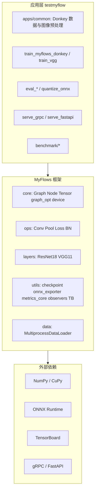

# 系统设计

## 1. 目标

MyFlows 是教学用 NumPy/CuPy 动态图深度学习框架；`testmyflow` 仓库在其上完成 Donkeycar 道路图像上的控制/分类实验，并满足学期任务书：数据增强、TensorBoard 五层训练可视化、Grad-CAM 解释算法、模型保存、INT8 推理、gRPC/FastAPI 部署、跨框架对比、计算图优化等。

## 2. 总体架构

## 3. 数据流（训练）

1. `apps/common/donkey_data.py` 从 `mycar/data/catalog_generated.catalog` 或 `images/*.jpg` 构建样本索引。
2. `apps/common/image_preprocess.py` 统一图像读取、resize、RGB/NCHW 预处理和 batch padding。
3. 可选 `utils/transforms` 增强；回归输出 `[angle, throttle]`，分类为 K 类。
4. 构建 `Variable` → `Layer` → `Graph`；`Adam.one_step()` 反向更新。
5. `TensorBoardLogger` 写标量、图像、文本、histogram；`utils/observers/` 分析梯度/参数/激活；`training_dashboard.py` 统一训练可视化编排；checkpoint JSON+NPZ；可选 `--graph-opt` 构图期融合。

## 4. 推理与部署

| 方式 | 入口 | 说明 |
|------|------|------|
| 离线 MyFlows | `load_checkpoint` | JSON+NPZ |
| 离线 ONNX | `apps/eval/eval_myflows_donkey_onnx.py` | FP32 / INT8 |
| 公共数据层 | `apps/common/donkey_data.py` / `image_preprocess.py` | 训练、评估、量化、解释共用 |
| gRPC | `apps/serve/serve_grpc.py` | 任务书 1.E |
| FastAPI | `apps/serve/serve_fastapi.py` | HTTP 服务化部署 |
| 客户端 SDK | `apps/serve/grpc_client.py` / `apps/serve/fastapi_client.py` | 封装请求、超时、响应解析 |
| Docker | `deploy/docker/` | compose 一键起服务 |
| K8s | `deploy/k8s/` | Deployment + NodePort |

## 5. 与 Donkeycar 集成

`mycar/myflows_pilot.py`：仿真/实车加载 ONNX 或 checkpoint，输出 `pilot/angle` 与 `pilot/throttle`。

## 6. 实验与文档

- `docs/experiments/int8_report.md`：量化对比
- `docs/experiments/explainability/`：Grad-CAM 输出
- `docs/experiments/training_viz/`：训练曲线与 TB 截图
- `docs/final_report.md`：期末报告正文
